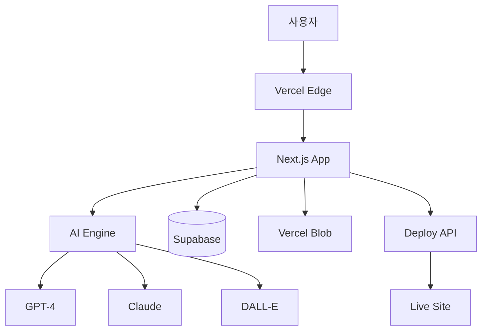

# Aether MVP - Product Requirements Document (PRD) v2.0

## 1. 프로젝트 개요

### 1.1 제품 정보
- **제품명**: Aether
- **버전**: MVP v2.0
- **개발 기간**: 1주일 (Working Prototype) + 1주일 (Production Ready)
- **개발 인원**: 1인 개발 (AI 페어 프로그래밍)
- **제품 비전**: "AI가 30초 안에 전문 웹사이트를 만들고, 누구나 5분 안에 커스터마이징할 수 있는 차세대 웹 빌더"

### 1.2 핵심 가치 제안 (Value Proposition)
- **초고속**: 텍스트 입력부터 라이브 사이트까지 30초
- **AI 우선**: AI가 디자인, 개발, 콘텐츠를 모두 생성
- **즉시 배포**: 생성 즉시 실제 도메인에서 작동
- **비주얼 편집**: 코드 없이 드래그앤드롭으로 수정

### 1.3 타겟 사용자
- **Primary**: AI 도구에 익숙한 스타트업 창업자
- **Secondary**: 빠른 프로토타입이 필요한 개발자/디자이너
- **Tertiary**: 온라인 비즈니스를 시작하는 소상공인

### 1.4 경쟁 차별화
| 특성 | Framer | Webflow | Wix | **Aether** |
|------|--------|---------|-----|-----------|
| 사이트 생성 시간 | 2시간 | 5시간 | 3시간 | **30초** |
| AI 통합 수준 | 중간 | 낮음 | 중간 | **매우 높음** |
| 최소 비용 | $5/월 | $14/월 | $16/월 | **무료** |
| 학습 곡선 | 중간 | 높음 | 낮음 | **매우 낮음** |
| 코드 내보내기 | X | O | X | **O** |

## 2. MVP 범위 정의

### 2.1 Week 1 - AI-First Prototype (필수)
✅ **포함**
- AI 전체 사이트 생성 (프롬프트 → 완성된 사이트)
- 실시간 비주얼 에디터 (React 기반)
- 10개 AI 최적화 템플릿
- 원클릭 Vercel 배포
- 실시간 프리뷰 & 반응형 뷰

❌ **제외**
- 사용자 인증 시스템
- 결제 시스템
- 팀 협업 기능
- 템플릿 마켓플레이스

### 2.2 Week 2 - Production Ready (확장)
- 사용자 계정 & 프로젝트 관리
- 커스텀 도메인 연결
- AI 컴포넌트 생성기
- 기본 협업 기능 (공유 링크)
- 분석 대시보드 (기본)

## 3. 기술 아키텍처

### 3.1 기술 스택
```yaml
Frontend:
  - Framework: Next.js 14 (App Router)
  - UI Library: React 18
  - Visual Editor: Custom React-based Canvas
  - Styling: Tailwind CSS + Framer Motion
  - State: Zustand + Immer
  - AI Integration: Vercel AI SDK

Backend:
  - Runtime: Edge Runtime (Vercel)
  - Database: PostgreSQL (Supabase)
  - AI Gateway: OpenAI + Anthropic (fallback)
  - File Storage: Vercel Blob
  
AI Stack:
  - Primary: GPT-4-turbo (구조 생성)
  - Secondary: Claude-3-haiku (콘텐츠)
  - Image: DALL-E 3 / Stable Diffusion
  - Embeddings: OpenAI text-embedding-3

Deployment:
  - Hosting: Vercel (자동 스케일링)
  - CDN: Vercel Edge Network
  - Domain: Vercel Domains API
  - Analytics: Vercel Analytics
```

### 3.2 시스템 아키텍처


## 4. AI 엔진 설계

### 4.1 AI 사이트 생성 파이프라인
```typescript
interface AISiteGenerator {
  // 1단계: 컨텍스트 이해
  analyzePrompt(prompt: string): BusinessContext;
  
  // 2단계: 구조 생성
  generateStructure(context: BusinessContext): SiteStructure;
  
  // 3단계: 콘텐츠 생성
  generateContent(structure: SiteStructure): ContentMap;
  
  // 4단계: 디자인 생성
  generateDesign(structure: SiteStructure): DesignSystem;
  
  // 5단계: 컴포넌트 조립
  assembleComponents(all: GeneratedAssets): ReactComponentTree;
}

// 실행 시간 목표
const PERFORMANCE_TARGETS = {
  total: 30, // 초
  structure: 5,
  content: 10,
  design: 5,
  assembly: 10
};
```

### 4.2 프롬프트 엔지니어링
```javascript
const SYSTEM_PROMPT = `
You are an expert web designer and developer.
Generate a complete website structure optimized for conversion.

Output format: React component tree with:
1. Semantic HTML structure
2. Tailwind CSS classes
3. Accessibility attributes
4. SEO metadata
5. Performance optimizations

Style: Modern, clean, professional
Framework: Next.js 14 with App Router
`;

const enhanceUserPrompt = (input) => ({
  business: extractBusinessInfo(input),
  style: detectStylePreference(input),
  features: identifyRequiredFeatures(input),
  industry: classifyIndustry(input),
  tone: analyzeTone(input)
});
```

### 4.3 AI 컴포넌트 생성기
```typescript
interface AIComponentGenerator {
  // 자연어 → React 컴포넌트
  generateComponent(description: string): {
    code: string;
    props: ComponentProps;
    dependencies: string[];
    preview: string;
  };
  
  // 지원 컴포넌트 타입
  supportedTypes: [
    'InteractiveChart',
    'AnimatedCounter',
    '3DProductViewer',
    'ParallaxSection',
    'VideoBackground',
    'CustomForm',
    'LiveDataFeed'
  ];
}
```

## 5. 비주얼 에디터 설계

### 5.1 Canvas 기반 에디터
```typescript
interface VisualEditor {
  // 핵심 기능
  canvas: {
    freeformDesign: boolean;
    gridSnapping: boolean;
    rulerGuides: boolean;
    layerManagement: boolean;
  };
  
  // 인터랙션
  interactions: {
    dragAndDrop: boolean;
    resizeHandles: boolean;
    rotationControl: boolean;
    alignmentTools: boolean;
  };
  
  // 실시간 기능
  realtime: {
    preview: boolean;
    collaboration: boolean;
    autoSave: boolean;
    versionHistory: boolean;
  };
}
```

### 5.2 컴포넌트 시스템
```typescript
// 컴포넌트 구조
interface ComponentSystem {
  // 마스터-인스턴스 관계
  master: MasterComponent;
  instances: ComponentInstance[];
  
  // 변형 시스템
  variants: {
    breakpoints: ['mobile', 'tablet', 'desktop'];
    themes: ['light', 'dark', 'auto'];
    states: ['default', 'hover', 'active', 'disabled'];
  };
  
  // 속성 시스템
  props: {
    content: EditableContent;
    styles: EditableStyles;
    animations: AnimationPresets;
  };
}
```

## 6. 템플릿 & 마켓플레이스

### 6.1 초기 템플릿 (Week 1)
```yaml
Essential Templates:
  1. SaaS Landing:
     - Hero with CTA
     - Feature Grid
     - Pricing Table
     - Testimonials
     
  2. Portfolio:
     - Project Gallery
     - About Section
     - Contact Form
     - Resume Download
     
  3. E-commerce:
     - Product Showcase
     - Category Grid
     - Cart Preview
     - Checkout Flow
     
  4. Blog:
     - Article List
     - Featured Post
     - Author Bio
     - Newsletter
     
  5. Restaurant:
     - Menu Display
     - Reservation
     - Gallery
     - Location Map
```

### 6.2 마켓플레이스 (Phase 2)
```yaml
Creator Program:
  Revenue Share:
    - Month 1-6: Creator 100%
    - Month 7+: Creator 80% / Platform 20%
  
  Quality Standards:
    - Performance Score: 90+
    - Accessibility: WCAG 2.1 AA
    - Responsive: All devices
    - SEO: Optimized
  
  Incentives:
    - Featured Creators
    - Monthly Rewards
    - Early Access to Features
```

## 7. API 설계

### 7.1 Core APIs
```yaml
AI Generation:
  POST /api/ai/generate:
    request:
      prompt: string
      style?: StylePreset
      industry?: Industry
      features?: Feature[]
    response:
      siteId: string
      preview: string
      status: 'generating' | 'complete'
      estimatedTime: number
      
  GET /api/ai/status/{siteId}:
    response:
      progress: number
      currentStep: string
      preview: string

Site Management:
  GET /api/sites:
    response: Site[]
    
  PUT /api/sites/{id}:
    request: ComponentTree
    response: UpdatedSite
    
  DELETE /api/sites/{id}:
    response: Success

Deployment:
  POST /api/deploy/{siteId}:
    request:
      domain?: string
      environment: 'preview' | 'production'
    response:
      url: string
      deploymentId: string
      
  GET /api/deploy/status/{deploymentId}:
    response:
      status: DeploymentStatus
      url?: string
      error?: string
```

### 7.2 Webhook Events
```typescript
interface WebhookEvents {
  'site.created': { siteId: string };
  'site.updated': { siteId: string, changes: Change[] };
  'site.deployed': { siteId: string, url: string };
  'ai.generation.complete': { siteId: string, duration: number };
  'user.upgraded': { userId: string, plan: string };
}
```

## 8. 개발 로드맵

### 8.1 Week 1: AI-First Prototype
```markdown
Day 1 (월): 프로젝트 설정 및 AI 통합
- [ ] Next.js + Vercel 설정
- [ ] OpenAI API 통합
- [ ] 기본 프롬프트 엔진 구현
- [ ] Supabase 설정

Day 2 (화): AI 사이트 생성기
- [ ] 구조 생성 AI 구현
- [ ] 콘텐츠 생성 AI 구현
- [ ] 디자인 시스템 생성
- [ ] 컴포넌트 조립 로직

Day 3 (수): 비주얼 에디터 기초
- [ ] Canvas 컴포넌트 구현
- [ ] 드래그앤드롭 구현
- [ ] 선택/편집 도구
- [ ] 실시간 프리뷰

Day 4 (목): 템플릿 시스템
- [ ] 5개 핵심 템플릿 제작
- [ ] 템플릿 → AI 연결
- [ ] 커스터마이징 로직
- [ ] 반응형 처리

Day 5 (금): 배포 시스템
- [ ] Vercel Deploy API 통합
- [ ] 도메인 관리
- [ ] 빌드 최적화
- [ ] CDN 설정

Day 6-7 (주말): 통합 및 테스트
- [ ] 전체 플로우 테스트
- [ ] 성능 최적화
- [ ] 버그 수정
- [ ] 데모 준비
```

### 8.2 Week 2: Production Ready
```markdown
Day 8-9: 사용자 시스템
- 인증/인가 구현
- 프로젝트 관리
- 사용자 대시보드

Day 10-11: AI 고도화
- AI 컴포넌트 생성기
- 다국어 지원
- SEO 최적화

Day 12-13: 협업 & 분석
- 공유 기능
- 기본 분석
- 피드백 수집

Day 14: 런칭 준비
- Production 배포
- 모니터링 설정
- 문서화
```

## 9. 성공 지표 (KPIs)

### 9.1 기술적 지표
```yaml
Performance:
  - AI 생성 시간: < 30초 ✨
  - 페이지 로드: < 1.5초
  - Lighthouse 점수: 95+
  - 에러율: < 0.1%
  
Quality:
  - AI 생성 성공률: > 95%
  - 사용자 수정 없이 배포: > 60%
  - 모바일 완벽 대응: 100%
```

### 9.2 비즈니스 지표
```yaml
Week 1:
  - 프로토타입 완성도: 100%
  - 테스트 사이트 생성: 50개
  - 피드백 수집: 20명
  
Week 2:
  - 베타 사용자: 100명
  - 생성된 사이트: 500개
  - 배포된 사이트: 100개
  - 유료 전환: 5%
  
Month 1:
  - MAU: 1,000명
  - 생성 사이트: 5,000개
  - 유료 사용자: 50명
  - MRR: $500
```

## 10. 가격 전략

### 10.1 Freemium Model
```yaml
Free (Forever):
  - 3개 프로젝트
  - AI 생성 월 10회
  - Aether 서브도메인
  - 기본 템플릿 5개
  - 커뮤니티 지원
  
Starter ($5/월):
  - 10개 프로젝트
  - AI 생성 월 100회
  - 커스텀 도메인 1개
  - 모든 템플릿 접근
  - 이메일 지원
  
Pro ($19/월):
  - 무제한 프로젝트
  - AI 생성 무제한
  - 커스텀 도메인 5개
  - AI 컴포넌트 생성기
  - 우선 지원
  - 협업 기능
  
Business ($49/월):
  - Pro 모든 기능 +
  - 팀 계정 (5명)
  - White label
  - API 접근
  - 전담 지원
```

## 11. 리스크 관리

### 11.1 기술적 리스크
| 리스크 | 확률 | 영향 | 대응 방안 |
|--------|------|------|-----------|
| AI API 비용 폭증 | 높음 | 높음 | 캐싱, Rate Limiting, 다중 모델 |
| 생성 품질 불일치 | 중간 | 높음 | Fine-tuning, 템플릿 폴백 |
| 성능 이슈 | 낮음 | 중간 | Edge 함수, 비동기 처리 |
| 보안 취약점 | 중간 | 높음 | 정기 감사, CSP, Rate Limit |

### 11.2 대응 전략
```javascript
const riskMitigation = {
  costControl: {
    caching: 'Redis 24시간 캐시',
    rateLimit: '사용자당 시간당 10회',
    modelSelection: 'GPT-3.5 폴백'
  },
  qualityAssurance: {
    validation: 'JSON Schema 검증',
    preview: '생성 전 미리보기',
    rollback: '이전 버전 복구'
  },
  performance: {
    cdn: 'Vercel Edge Network',
    lazyLoad: '컴포넌트 지연 로딩',
    streaming: 'React Server Components'
  }
};
```

## 12. 차별화 전략

### 12.1 Aether만의 독특한 기능
```yaml
"AI-First" 차별화:
  1. Conversational Design:
     - 채팅으로 실시간 수정
     - "로고를 더 크게 해줘" → 즉시 반영
  
  2. Auto-Evolution:
     - A/B 테스트 자동 실행
     - 성과 기반 자동 최적화
  
  3. Multi-Site Generation:
     - 한 번에 여러 버전 생성
     - 최적 버전 자동 선택
  
  4. Code Export:
     - Next.js 프로젝트로 내보내기
     - GitHub 자동 푸시
  
  5. AI Learning:
     - 사용자 선호 학습
     - 개인화된 생성 결과
```

### 12.2 경쟁사 대비 포지셔닝
```
Framer: "디자이너를 위한 노코드 툴"
Webflow: "개발자를 위한 비주얼 툴"  
Wix: "초보자를 위한 웹사이트 빌더"

Aether: "AI가 전문가를 대체하는 차세대 웹 빌더"
→ 디자이너도, 개발자도 필요 없는 완전 자동화
```

## 13. 개발 체크리스트

### 13.1 Day 1 시작 전 준비
- [ ] Vercel 계정 및 프로젝트 생성
- [ ] OpenAI API 키 발급 ($100 크레딧)
- [ ] Supabase 프로젝트 생성
- [ ] GitHub 레포지토리 설정
- [ ] Figma 디자인 시스템 준비

### 13.2 핵심 마일스톤
```markdown
## Must Have (Week 1)
- [ ] 30초 내 AI 사이트 생성
- [ ] 드래그앤드롭 편집
- [ ] 원클릭 배포
- [ ] 5개 템플릿

## Nice to Have (Week 2)  
- [ ] AI 컴포넌트 생성
- [ ] 협업 기능
- [ ] 분석 대시보드
- [ ] 마켓플레이스
```

## 14. 성장 전략

### 14.1 초기 고객 확보
```yaml
Launch Strategy:
  Week 1:
    - Product Hunt 런칭
    - HackerNews Show HN
    - Twitter/X 데모 비디오
    - Reddit r/webdev
  
  Week 2:
    - 인플루언서 아웃리치
    - YouTube 튜토리얼
    - 무료 크레딧 제공
    - 얼리버드 할인
  
  Month 1:
    - SEO 콘텐츠 마케팅
    - 제휴 프로그램
    - 커뮤니티 구축
    - 기능 요청 투표
```

### 14.2 장기 비전 (Post-MVP)
```yaml
3개월:
  - B2B 기능 (에이전시 플랜)
  - WordPress 마이그레이션
  - Shopify 통합
  
6개월:
  - 모바일 앱 에디터
  - AI 음성 명령
  - 자동 번역 100개 언어
  
1년:
  - AI 에이전트 (자율 운영)
  - 멀티채널 배포 (앱, 이메일)
  - Enterprise 플랜
```

## 15. 결론

Aether는 **"AI-First Web Builder"**라는 명확한 포지셔닝으로 기존 노코드 툴의 한계를 극복합니다. 

**핵심 성공 요소:**
1. **속도**: 30초 내 실제 작동하는 웹사이트
2. **품질**: GPT-4 기반 전문가 수준 결과물
3. **접근성**: 무료 시작, $5 최소 비용
4. **확장성**: 코드 내보내기로 vendor lock-in 해결

**Week 1 목표**: "작동하는 마법" 구현  
**Week 2 목표**: "제품화 및 수익 모델" 검증

이 접근법으로 Framer의 장점(속도, UX)과 Webflow의 장점(확장성)을 결합하면서, AI라는 차별화 요소로 완전히 새로운 카테고리를 창출할 수 있습니다.
