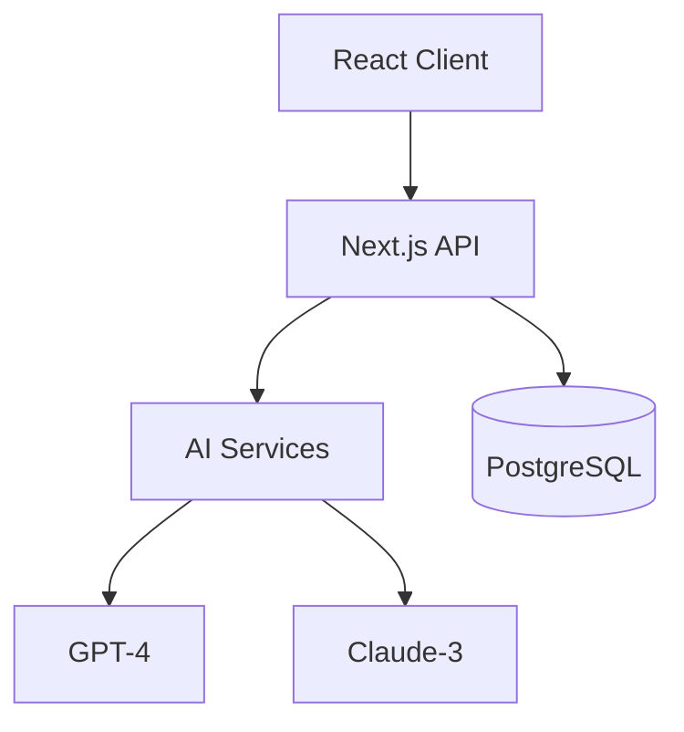

# Aether AI Prompt Library

## Overview
이 문서는 Aether AI 웹사이트 빌더 개발을 위한 포괄적인 프롬프트 라이브러리입니다. 각 프롬프트는 GPT-4, Claude-3, 그리고 기타 LLM과 함께 사용하도록 최적화되어 있으며, 즉시 복사하여 사용할 수 있는 형식으로 제공됩니다.

### 사용 방법
1. 필요한 작업에 맞는 카테고리를 찾습니다
2. 해당 프롬프트를 복사합니다
3. `{variable}` 형식의 변수를 실제 값으로 교체합니다
4. LLM에 입력하여 코드를 생성합니다

### 기술 스택 참조
- **Frontend**: Next.js 14 (App Router), React 18, Tailwind CSS, Framer Motion
- **State**: Zustand + Immer
- **Backend**: Vercel Edge Runtime, Supabase (PostgreSQL)
- **AI**: OpenAI GPT-4, Claude-3, DALL-E 3
- **Deployment**: Vercel
- **Testing**: Vitest, Playwright

---

## 1. Project Setup Prompts

### 1.1 Initialize Next.js Project with Supabase

**Purpose**: Aether 프로젝트 초기 설정 및 핵심 의존성 설치

**Context Template**:
"""
You are an expert Next.js and Supabase developer.
Project: Aether - AI Website Builder
Tech Stack: Next.js 14 (App Router), TypeScript, Supabase, Tailwind CSS
Current Task: Initialize project with all required dependencies
"""

**Input Variables**:
- {project_name}: 프로젝트 이름 (default: "aether")
- {supabase_url}: Supabase 프로젝트 URL
- {supabase_anon_key}: Supabase Anon Key

**Main Prompt**:
"""
Create a new Next.js 14 project with TypeScript and App Router for an AI website builder called Aether.

Requirements:
1. Use pnpm as package manager
2. Configure Next.js 14 with App Router
3. Set up TypeScript with strict mode
4. Install and configure Tailwind CSS with custom design system
5. Set up Supabase client with TypeScript types
6. Configure environment variables for API keys
7. Set up Turborepo for monorepo structure
8. Add Vercel deployment configuration

Constraints:
- Use Edge Runtime for API routes
- Enable experimental features for streaming
- Configure for optimal Core Web Vitals

Output Format:
Provide complete setup commands, configuration files, and folder structure.
"""

**Example Usage**:
```bash
pnpm create next-app@latest aether --typescript --app --tailwind
cd aether
pnpm add @supabase/supabase-js @supabase/auth-helpers-nextjs
pnpm add -D @types/node
```

**Expected Output**:
Complete project structure with all configuration files (next.config.js, tailwind.config.js, tsconfig.json) and initial setup.

---

### 1.2 Configure Turborepo Monorepo

**Purpose**: 모노레포 구조 설정으로 패키지 관리 최적화

**Context Template**:
"""
You are a monorepo architecture expert.
Project: Aether - Multi-package Next.js application
Tech Stack: Turborepo, pnpm workspaces
Current Task: Set up monorepo with shared packages
"""

**Input Variables**:
- {packages}: 패키지 목록 (ui, ai-engine, editor-core, templates)

**Main Prompt**:
"""
Set up a Turborepo monorepo structure for Aether with the following packages:
- apps/web (main Next.js app)
- apps/preview (preview server)
- packages/ui (shared components)
- packages/ai-engine (AI generation logic)
- packages/editor-core (visual editor)
- packages/templates (template system)
- packages/database (Prisma schema)

Requirements:
1. Configure pnpm workspaces
2. Set up Turborepo pipelines for build, dev, test
3. Share TypeScript configurations
4. Configure ESLint and Prettier
5. Set up shared Tailwind config
6. Optimize for build caching

Output Format:
Complete turbo.json, package.json files, and workspace configuration.
"""

---

### 1.3 Setup Development Environment

**Purpose**: 개발 환경 설정 및 도구 구성

**Context Template**:
"""
You are a DevOps engineer specializing in JavaScript development environments.
Project: Aether
Current Task: Configure complete development environment
"""

**Main Prompt**:
"""
Configure a complete development environment for Aether including:

1. VS Code settings and recommended extensions
2. Git hooks with Husky for pre-commit checks
3. Environment variables management (.env.local structure)
4. Docker setup for local Supabase instance
5. Scripts for development workflow

Create configuration files:
- .vscode/settings.json
- .vscode/extensions.json
- .husky/pre-commit
- docker-compose.yml
- .env.example

Include scripts for:
- dev: concurrent development servers
- build: production build
- test: run all tests
- db:push: push Prisma schema
- db:migrate: run migrations
"""

---

### 1.4 Configure Tailwind Design System

**Purpose**: Aether 브랜드에 맞는 Tailwind CSS 커스터마이징

**Context Template**:
"""
You are a UI/UX developer expert in Tailwind CSS.
Project: Aether - Modern AI Website Builder
Design Requirements: Clean, professional, accessible
"""

**Main Prompt**:
"""
Create a custom Tailwind configuration for Aether with:

1. Custom color palette:
   - Primary: Blue (#0070f3)
   - Secondary: Dark (#000)
   - Accent: Gradient blues
   - Semantic colors (success, warning, error)

2. Typography scale optimized for web builders
3. Custom spacing and sizing scale
4. Animation presets for smooth interactions
5. Component-specific utilities

Include:
- Custom CSS variables for theming
- Dark mode support with class strategy
- Responsive breakpoints for editor canvas
- Custom plugins for editor-specific utilities

Output: Complete tailwind.config.js with extended theme
"""

---

### 1.5 Initialize Supabase Schema

**Purpose**: Supabase 데이터베이스 스키마 초기 설정

**Context Template**:
"""
You are a database architect specializing in PostgreSQL and Supabase.
Project: Aether
Current Task: Design and implement database schema
"""

**Main Prompt**:
"""
Create the complete Supabase database schema for Aether including:

Tables:
1. users (extended auth.users)
2. sites (website projects)
3. components (reusable components)
4. templates (site templates)
5. deployments (deployment history)
6. ai_generations (AI usage tracking)
7. subscriptions (billing)

For each table include:
- Column definitions with appropriate types
- Primary and foreign keys
- Indexes for performance
- RLS policies for security
- Triggers for updated_at

Special requirements:
- JSONB for component trees
- Full-text search on templates
- Optimized for real-time subscriptions

Output: Complete SQL migration file
"""

---

## 2. AI Integration Prompts

### 2.1 OpenAI GPT-4 Integration

**Purpose**: GPT-4 API 통합 및 사이트 생성 엔진 구현

**Context Template**:
"""
You are an AI engineer specializing in OpenAI API integration.
Project: Aether - AI Website Builder
Tech Stack: Next.js 14, TypeScript, OpenAI SDK
Current Task: Implement GPT-4 site generation engine
"""

**Input Variables**:
- {api_key}: OpenAI API key
- {model}: GPT-4 model version (gpt-4-turbo-preview)
- {max_tokens}: Maximum tokens per request

**Main Prompt**:
"""
Implement a GPT-4 powered site generation engine for Aether that:

1. Takes user prompt and generates complete website structure
2. Uses JSON mode for structured output
3. Implements streaming for real-time progress
4. Handles rate limiting and retries
5. Caches responses for efficiency

Create these components:
```typescript
interface AISiteGenerator {
  generateSite(prompt: string): Promise<SiteStructure>;
  generateComponent(description: string): Promise<Component>;
  optimizeContent(content: string, context: BusinessContext): Promise<string>;
  streamGeneration(prompt: string): AsyncGenerator<GenerationProgress>;
}
```

Requirements:
- 30-second generation target
- Error handling with fallbacks
- Token usage tracking
- Prompt enhancement pipeline
- Response validation with Zod

Output Format:
Complete TypeScript implementation with error handling
"""

**Example Usage**:
```typescript
const generator = new AISiteGenerator({
  apiKey: process.env.OPENAI_API_KEY,
  model: 'gpt-4-turbo-preview',
  temperature: 0.7
});

const site = await generator.generateSite(
  "Create a SaaS landing page for an AI writing tool"
);
```

---

### 2.2 Site Generation Pipeline

**Purpose**: 30초 내 AI 사이트 생성 파이프라인 구현

**Context Template**:
"""
You are an expert in AI pipeline architecture.
Project: Aether
Current Task: Build multi-stage generation pipeline
Performance Target: < 30 seconds total
"""

**Main Prompt**:
"""
Design and implement a multi-stage AI generation pipeline:

Stage 1: Context Analysis (5s)
- Extract business context from prompt
- Identify industry and style preferences
- Select appropriate template

Stage 2: Structure Generation (5s)
- Generate page hierarchy
- Define component layout
- Create navigation structure

Stage 3: Content Generation (10s)
- Generate copy for each section
- Create SEO metadata
- Generate alt text for images

Stage 4: Design System (5s)
- Select color scheme
- Choose typography
- Generate spacing system

Stage 5: Assembly & Optimization (5s)
- Combine all elements
- Optimize for performance
- Validate output

Implement with:
- Parallel processing where possible
- Progress streaming to client
- Fallback strategies for failures
- Caching for common patterns

Output: Complete pipeline implementation with progress tracking
"""

---

### 2.3 Prompt Chaining Implementation

**Purpose**: 복잡한 생성 작업을 위한 프롬프트 체이닝

**Context Template**:
"""
You are an AI prompt engineering expert.
Project: Aether
Current Task: Implement sophisticated prompt chaining
"""

**Main Prompt**:
"""
Create a prompt chaining system that:

1. Breaks complex requests into atomic tasks
2. Maintains context between prompts
3. Handles dependencies between stages
4. Implements error recovery

Example chain for "Create e-commerce site":
1. Analyze business requirements
2. Generate product categories
3. Create product listings
4. Design checkout flow
5. Generate marketing copy
6. Optimize for conversions

Implementation requirements:
- Context passing between stages
- Rollback on failure
- Partial result caching
- Dynamic chain modification

Output: PromptChain class with examples
"""

---

### 2.4 Streaming Response Handler

**Purpose**: 실시간 AI 생성 진행상황 스트리밍

**Context Template**:
"""
You are a real-time systems engineer.
Project: Aether
Tech Stack: Next.js 14, Server-Sent Events, React Suspense
Current Task: Implement streaming AI responses
"""

**Main Prompt**:
"""
Implement a streaming response system for AI generation:

Server side (API Route):
- Use Edge Runtime streaming
- Send progress updates via SSE
- Handle backpressure
- Implement chunked responses

Client side (React):
- Use Suspense for loading states
- Progressive rendering
- Real-time progress bar
- Preview updates as generated

Features:
- Show current generation step
- Display partial results
- Estimate remaining time
- Allow cancellation

Output: Complete streaming implementation with TypeScript
"""

---

### 2.5 AI Error Handling & Fallbacks

**Purpose**: 강건한 AI 에러 처리 및 폴백 시스템

**Context Template**:
"""
You are a reliability engineer for AI systems.
Project: Aether
Current Task: Implement comprehensive error handling
"""

**Main Prompt**:
"""
Design an error handling system for AI operations:

Error types to handle:
1. Rate limiting (429)
2. Token limits exceeded
3. API timeouts
4. Invalid responses
5. Service outages

Implement fallback strategies:
- GPT-4 → Claude-3 fallback
- Template-based generation fallback
- Cached response serving
- Graceful degradation

Features:
- Exponential backoff with jitter
- Circuit breaker pattern
- Error logging and monitoring
- User-friendly error messages

Output: Complete error handling module with retry logic
"""

---

### 2.6 Partial Generation Recovery

**Purpose**: AI 생성 중단 시 부분 결과 복구 및 완성

**Context Template**:
"""
You are an AI recovery specialist.
Project: Aether
Current Task: Complete interrupted site generation
"""

**Input Variables**:
- {partial_structure}: 부분적으로 생성된 구조
- {original_prompt}: 원본 사용자 프롬프트
- {last_successful_step}: 마지막 성공 단계
- {error_type}: 오류 유형

**Main Prompt**:
"""
Complete an interrupted site generation from a partial result:

Given:
1. Partially generated site structure that was interrupted
2. Original user prompt and requirements
3. Last successful generation step
4. Error that caused interruption

Tasks:
1. Analyze what was successfully generated
2. Identify missing required components
3. Determine safe resumption point
4. Complete generation from interruption point
5. Ensure consistency with existing parts
6. Validate final structure integrity

Partial structure:
```json
{partial_structure}
```

Original prompt: "{original_prompt}"
Last successful step: {last_successful_step}
Error type: {error_type}

Requirements:
- Maintain style consistency with generated parts
- Don't regenerate successful components
- Fill in missing sections completely
- Ensure all links and references work
- Validate component tree structure

Output: Complete site structure continuing from interruption point
"""

**Example Usage**:
```typescript
const recovery = await recoverGeneration({
  partialStructure: incompleteTree,
  originalPrompt: userPrompt,
  lastStep: 'content_generation',
  errorType: 'timeout'
});
```

**Expected Output**:
Complete site structure with recovered and newly generated parts seamlessly integrated.

---

### 2.7 Generation Validation

**Purpose**: AI 생성 결과 품질 검증 및 자동 수정

**Context Template**:
"""
You are a quality assurance AI.
Project: Aether
Current Task: Validate and fix generated site structure
"""

**Main Prompt**:
"""
Validate AI-generated site structure for quality and completeness:

1. Structure Validation:
   - Check HTML semantic correctness
   - Verify component hierarchy
   - Ensure no orphaned components
   - Validate all required sections present

2. Content Quality:
   - No placeholder text (Lorem ipsum)
   - Appropriate content length
   - Consistent tone and voice
   - SEO metadata complete

3. Design Consistency:
   - Color scheme applied throughout
   - Typography hierarchy correct
   - Spacing consistent
   - Responsive breakpoints defined

4. Performance Checks:
   - No excessive nesting (max 10 levels)
   - Image optimization flags
   - Lazy loading markers
   - Component count reasonable (<100)

5. Auto-fix Issues:
   - Replace placeholder text
   - Add missing metadata
   - Fix broken references
   - Optimize structure

Input structure:
```json
{site_structure}
```

Output format:
{
  "valid": boolean,
  "issues": [
    {
      "type": "error|warning",
      "component": "component_id",
      "message": "description",
      "autoFixed": boolean
    }
  ],
  "fixedStructure": {/* corrected structure */},
  "score": 0-100
}
"""

---

## 3. Component Development Prompts

### 3.1 Visual Editor Canvas Implementation

**Purpose**: 드래그앤드롭 비주얼 에디터 캔버스 구현

**Context Template**:
"""
You are a frontend expert specializing in visual editors.
Project: Aether Visual Editor
Tech Stack: React 18, TypeScript, Framer Motion
Current Task: Build drag-and-drop canvas editor
"""

**Input Variables**:
- {canvas_size}: Canvas dimensions
- {grid_size}: Grid snapping size

**Main Prompt**:
"""
Create a visual editor canvas component with:

Core Features:
1. Free-form drag and drop
2. Grid snapping (optional)
3. Ruler guides
4. Multi-select with lasso
5. Keyboard shortcuts
6. Undo/redo system
7. Layer management
8. Zoom and pan controls

Implementation:
```typescript
interface CanvasEditor {
  canvas: HTMLCanvasElement;
  selection: Selection;
  tools: ToolManager;
  history: HistoryManager;
  
  addComponent(component: Component, position: Point): void;
  moveComponent(id: string, delta: Point): void;
  resizeComponent(id: string, size: Size): void;
  deleteComponent(id: string): void;
}
```

Use:
- React DnD or custom drag implementation
- Intersection Observer for performance
- Virtual scrolling for large canvases
- RequestAnimationFrame for smooth updates

Output: Complete Canvas component with all interactions
"""

**Example Usage**:
```tsx
<CanvasEditor
  width={1920}
  height={1080}
  gridSize={8}
  onComponentAdd={handleAdd}
  onComponentUpdate={handleUpdate}
/>
```

---

### 3.2 Component Tree JSONB Management

**Purpose**: 효율적인 컴포넌트 트리 저장 및 조회

**Context Template**:
"""
You are a data structure expert.
Project: Aether
Tech Stack: PostgreSQL JSONB, Zustand
Current Task: Implement component tree state management
"""

**Main Prompt**:
"""
Design a component tree management system using JSONB:

Data Structure:
```typescript
interface ComponentTree {
  root: ComponentNode;
  version: string;
  metadata: TreeMetadata;
}

interface ComponentNode {
  id: string;
  type: ComponentType;
  props: Record<string, any>;
  children?: ComponentNode[];
  styles?: StyleConfig;
}
```

Features:
1. Efficient JSONB queries for subtrees
2. Optimistic updates with Zustand
3. Diff and patch for updates
4. Version control for history
5. Real-time collaboration support

Database operations:
- Insert/update component nodes
- Query specific paths
- Bulk updates
- Tree traversal queries

Client state management:
- Zustand store with Immer
- Computed selectors
- Middleware for persistence
- DevTools integration

Output: Complete implementation with database queries
"""

---

### 3.3 Real-time Preview System

**Purpose**: 변경사항 즉시 반영되는 실시간 프리뷰

**Context Template**:
"""
You are a real-time systems developer.
Project: Aether
Tech Stack: React, WebSocket, Supabase Realtime
Current Task: Build live preview system
"""

**Main Prompt**:
"""
Implement a real-time preview system that:

1. Instantly reflects editor changes
2. Supports multiple viewport sizes
3. Isolates preview in iframe
4. Syncs across multiple users
5. Handles hot module replacement

Architecture:
- Editor → State → Preview (unidirectional)
- Debounced updates (100ms)
- Differential updates only
- PostMessage for iframe communication

Features:
- Device preview (mobile, tablet, desktop)
- Interactive mode vs edit mode
- CSS hot injection
- Component hot swapping
- State persistence

Output: Complete preview system with iframe isolation
"""

---

### 3.4 Zustand State Management

**Purpose**: 복잡한 에디터 상태 관리

**Context Template**:
"""
You are a state management expert.
Project: Aether Editor
Tech Stack: Zustand, Immer, TypeScript
Current Task: Design editor state architecture
"""

**Main Prompt**:
"""
Create a Zustand store for the visual editor:

Store Structure:
```typescript
interface EditorStore {
  // State
  components: ComponentMap;
  selection: string[];
  history: HistoryStack;
  viewport: Viewport;
  
  // Actions
  addComponent: (component: Component) => void;
  updateComponent: (id: string, updates: Partial<Component>) => void;
  deleteComponent: (id: string) => void;
  selectComponent: (id: string, multi?: boolean) => void;
  undo: () => void;
  redo: () => void;
  
  // Computed
  selectedComponents: () => Component[];
  canUndo: () => boolean;
  canRedo: () => boolean;
}
```

Features:
- Immer for immutable updates
- Persist middleware for local storage
- DevTools middleware
- Subscriptions for specific slices
- Performance optimizations

Output: Complete Zustand store with TypeScript
"""

---

### 3.5 Responsive Design Controls

**Purpose**: 반응형 디자인 편집 도구

**Context Template**:
"""
You are a responsive design expert.
Project: Aether Editor
Current Task: Build responsive design controls
"""

**Main Prompt**:
"""
Create responsive design controls for the editor:

Features:
1. Breakpoint selector (mobile, tablet, desktop, custom)
2. Per-breakpoint property editing
3. Responsive preview
4. CSS Grid/Flexbox visual tools
5. Container queries support

Implementation:
- Breakpoint manager
- Responsive property panel
- Visual breakpoint indicators
- CSS generation for each breakpoint
- Preview at different sizes

UI Components:
- Breakpoint switcher toolbar
- Responsive property inputs
- Visual grid overlay
- Spacing visualizer

Output: Complete responsive editing system
"""

---

## 4. Backend API Prompts

### 4.1 API Routes with Edge Runtime

**Purpose**: Next.js 14 App Router API 라우트 구현

**Context Template**:
"""
You are a Next.js API expert.
Project: Aether
Tech Stack: Next.js 14 App Router, Edge Runtime, TypeScript
Current Task: Create API routes
"""

**Input Variables**:
- {resource}: API 리소스 (sites, templates, deployments)
- {operations}: CRUD operations needed

**Main Prompt**:
"""
Create Next.js 14 API routes using App Router and Edge Runtime:

Route: /api/{resource}/route.ts

Requirements:
1. Use Edge Runtime for performance
2. Implement proper HTTP methods (GET, POST, PUT, DELETE)
3. Add request validation with Zod
4. Include error handling
5. Add rate limiting
6. Implement authentication check
7. Return proper status codes

Example structure:
```typescript
export const runtime = 'edge';

export async function GET(request: Request) {
  // Implementation
}

export async function POST(request: Request) {
  // Implementation
}
```

Include:
- Request/response type definitions
- Supabase client initialization
- Error handling middleware
- CORS headers

Output: Complete API route with all methods
"""

---

### 4.2 Supabase Row Level Security

**Purpose**: RLS 정책으로 데이터 보안 구현

**Context Template**:
"""
You are a Supabase security expert.
Project: Aether
Current Task: Implement Row Level Security policies
"""

**Main Prompt**:
"""
Create comprehensive RLS policies for all Aether tables:

Tables and policies needed:
1. users
   - Users can view own profile
   - Users can update own profile
   
2. sites
   - Users can CRUD own sites
   - Published sites are publicly readable
   - Enforce site limits per subscription
   
3. components
   - Users can CRUD own components
   - Public components are readable by all
   
4. deployments
   - Users can view own deployments
   - Users can create deployments for own sites

For each policy:
- Define SQL policy
- Add check constraints
- Include subscription tier checks
- Add usage limit enforcement

Output: Complete SQL for all RLS policies
"""

---

### 4.3 Real-time Subscriptions

**Purpose**: Supabase Realtime 구독 구현

**Context Template**:
"""
You are a real-time systems developer.
Project: Aether
Tech Stack: Supabase Realtime, TypeScript
Current Task: Implement real-time features
"""

**Main Prompt**:
"""
Implement Supabase Realtime subscriptions for:

1. Site updates (component changes)
2. Deployment status
3. AI generation progress
4. Collaborative editing (presence)

Create subscription handlers:
```typescript
// Site updates
const siteChannel = supabase
  .channel(`sites:${siteId}`)
  .on('postgres_changes', {
    event: '*',
    schema: 'public',
    table: 'sites',
    filter: `id=eq.${siteId}`
  }, handleSiteUpdate)
  
// Presence for collaboration
  .on('presence', { event: 'sync' }, handlePresence)
  .on('broadcast', { event: 'cursor' }, handleCursor);
```

Include:
- Connection management
- Reconnection logic
- Error handling
- Cleanup on unmount

Output: Complete real-time implementation
"""

---

### 4.4 Rate Limiting Implementation

**Purpose**: API 레이트 리미팅으로 서비스 보호

**Context Template**:
"""
You are a backend security engineer.
Project: Aether
Tech Stack: Upstash Redis, Next.js Middleware
Current Task: Implement rate limiting
"""

**Main Prompt**:
"""
Implement tiered rate limiting for Aether API:

Tiers:
- Free: 10 AI generations/hour, 100 API calls/hour
- Starter: 100 AI generations/hour, 500 API calls/hour  
- Pro: 1000 AI generations/hour, 2000 API calls/hour
- Business: Unlimited

Implementation:
1. Use Upstash Redis for distributed rate limiting
2. Implement sliding window algorithm
3. Add middleware to check limits
4. Return proper headers (X-RateLimit-*)
5. Different limits per endpoint

Create middleware that:
- Identifies user tier
- Checks current usage
- Enforces limits
- Returns 429 when exceeded

Output: Complete rate limiting implementation
"""

---

## 5. Testing & Debugging Prompts

### 5.1 Vitest Unit Testing

**Purpose**: 컴포넌트 및 유틸리티 유닛 테스트

**Context Template**:
"""
You are a testing expert.
Project: Aether
Tech Stack: Vitest, React Testing Library, TypeScript
Current Task: Write comprehensive unit tests
"""

**Input Variables**:
- {component}: Component to test
- {coverage_target}: Target coverage percentage

**Main Prompt**:
"""
Write comprehensive Vitest unit tests for {component}:

Test categories:
1. Component rendering
2. User interactions
3. State management
4. API calls (mocked)
5. Error scenarios
6. Edge cases

Example test structure:
```typescript
describe('ComponentName', () => {
  it('should render correctly', () => {
    // Test implementation
  });
  
  it('should handle user interaction', async () => {
    // Test implementation
  });
  
  it('should handle errors gracefully', () => {
    // Test implementation
  });
});
```

Include:
- Setup and teardown
- Mock implementations
- Async testing
- Snapshot tests where appropriate
- Coverage reporting

Output: Complete test suite with {coverage_target}% coverage
"""

---

### 5.2 Playwright E2E Testing

**Purpose**: 전체 사용자 플로우 E2E 테스트

**Context Template**:
"""
You are an E2E testing specialist.
Project: Aether
Tech Stack: Playwright, TypeScript
Current Task: Create E2E test scenarios
"""

**Main Prompt**:
"""
Create Playwright E2E tests for critical user flows:

1. AI Site Generation Flow
   - Enter prompt
   - Wait for generation
   - Verify preview
   - Deploy site

2. Visual Editor Flow
   - Add components
   - Edit properties
   - Preview changes
   - Save project

3. Deployment Flow
   - Configure domain
   - Deploy to production
   - Verify live site

Test structure:
```typescript
test('complete site generation flow', async ({ page }) => {
  // Navigate to app
  // Input prompt
  // Wait for generation (30s timeout)
  // Verify result
  // Deploy
});
```

Include:
- Page object pattern
- Visual regression tests
- Performance metrics
- Accessibility checks

Output: Complete E2E test suite
"""

---

### 5.3 AI Generation Testing

**Purpose**: AI 생성 결과 품질 검증

**Context Template**:
"""
You are an AI quality assurance engineer.
Project: Aether
Current Task: Test AI generation quality
"""

**Main Prompt**:
"""
Create tests to validate AI generation quality:

Test aspects:
1. Structure validation
   - Valid HTML structure
   - Component hierarchy
   - No missing required elements

2. Content quality
   - No placeholder text
   - Appropriate content length
   - SEO metadata present

3. Performance metrics
   - Generation time < 30s
   - Token usage within limits
   - Response size acceptable

4. Consistency
   - Style consistency
   - Brand alignment
   - Template adherence

Create validation functions:
```typescript
function validateSiteStructure(site: SiteStructure): ValidationResult
function validateContent(content: Content): ValidationResult
function validatePerformance(metrics: Metrics): ValidationResult
```

Output: Complete AI testing framework
"""

---

### 5.4 Performance Profiling

**Purpose**: 성능 병목 지점 찾기 및 최적화

**Context Template**:
"""
You are a performance engineer.
Project: Aether
Current Task: Profile and optimize performance
"""

**Main Prompt**:
"""
Create performance profiling and optimization tools:

Areas to profile:
1. AI generation pipeline
2. Component rendering
3. Database queries
4. API response times
5. Client-side bundle size

Implement profiling:
```typescript
class PerformanceProfiler {
  measureAIGeneration(): Metrics
  measureRenderTime(): Metrics
  measureDatabaseQuery(): Metrics
  analyzeBundleSize(): BundleAnalysis
}
```

Optimization targets:
- LCP < 1.5s
- FID < 100ms
- CLS < 0.1
- AI generation < 30s
- API response < 200ms

Output: Profiling tools and optimization recommendations
"""

---

## 6. Documentation Prompts

### 6.1 OpenAPI Specification

**Purpose**: API 문서 자동 생성

**Context Template**:
"""
You are an API documentation expert.
Project: Aether
Current Task: Generate OpenAPI specification
"""

**Main Prompt**:
"""
Generate complete OpenAPI 3.0 specification for Aether API:

Include all endpoints:
- /api/ai/generate
- /api/sites
- /api/templates
- /api/deployments
- /api/users

For each endpoint document:
- HTTP methods
- Request parameters
- Request body schema
- Response schemas
- Error responses
- Authentication requirements
- Rate limits

Format:
```yaml
openapi: 3.0.0
info:
  title: Aether API
  version: 1.0.0
paths:
  /api/ai/generate:
    post:
      summary: Generate website from prompt
      # ... complete specification
```

Output: Complete OpenAPI spec file
"""

---

### 6.2 Component Documentation

**Purpose**: React 컴포넌트 JSDoc 문서화

**Context Template**:
"""
You are a documentation specialist.
Project: Aether
Current Task: Document React components
"""

**Main Prompt**:
"""
Generate comprehensive JSDoc documentation for React components:

Documentation should include:
1. Component purpose
2. Props interface with descriptions
3. Usage examples
4. Important notes
5. Related components

Format:
```typescript
/**
 * Visual editor canvas component for drag-and-drop interface
 * 
 * @component
 * @example
 * ```tsx
 * <EditorCanvas
 *   width={1920}
 *   height={1080}
 *   onComponentAdd={handleAdd}
 * />
 * ```
 * 
 * @param {EditorCanvasProps} props - Component props
 * @param {number} props.width - Canvas width in pixels
 * @param {number} props.height - Canvas height in pixels
 * @param {Function} props.onComponentAdd - Callback when component is added
 * 
 * @returns {JSX.Element} Rendered canvas
 * 
 * @see {@link CanvasToolbar} - Related toolbar component
 * @see {@link ComponentPanel} - Component selection panel
 */
```

Output: Complete component documentation
"""

---

### 6.3 Architecture Diagrams

**Purpose**: 시스템 아키텍처 다이어그램 생성

**Context Template**:
"""
You are a system architect.
Project: Aether
Current Task: Create architecture diagrams
"""

**Main Prompt**:
"""
Create Mermaid diagrams for Aether architecture:

1. System Overview


2. AI Generation Pipeline
3. Deployment Flow
4. Data Flow
5. Authentication Flow

For each diagram include:
- All major components
- Data flow directions
- External service integrations
- Key decision points

Output: Complete set of Mermaid diagrams
"""

---

## 7. Code Review Prompts

### 7.1 Security Vulnerability Assessment

**Purpose**: 보안 취약점 검사 및 개선

**Context Template**:
"""
You are a security engineer.
Project: Aether
Current Task: Security audit and recommendations
"""

**Main Prompt**:
"""
Perform a comprehensive security audit of the codebase:

Check for:
1. SQL injection vulnerabilities
2. XSS vulnerabilities  
3. CSRF protection
4. Authentication bypasses
5. Rate limiting gaps
6. Sensitive data exposure
7. Dependency vulnerabilities
8. CORS misconfigurations

For each finding provide:
- Severity level (Critical/High/Medium/Low)
- Description of vulnerability
- Proof of concept (if applicable)
- Remediation steps
- Code fix example

Output format:
```markdown
## Security Audit Report
### Critical Findings
### High Priority
### Medium Priority
### Recommendations
```

Output: Complete security audit report
"""

---

### 7.2 Performance Optimization Review

**Purpose**: Core Web Vitals 및 성능 최적화

**Context Template**:
"""
You are a performance optimization expert.
Project: Aether
Target: Core Web Vitals optimization
"""

**Main Prompt**:
"""
Review and optimize code for Core Web Vitals:

Optimization areas:
1. Largest Contentful Paint (LCP)
   - Image optimization
   - Font loading
   - Critical CSS

2. First Input Delay (FID)
   - JavaScript execution
   - Main thread blocking

3. Cumulative Layout Shift (CLS)
   - Image dimensions
   - Dynamic content

Review checklist:
- Bundle size analysis
- Code splitting opportunities
- Lazy loading implementation
- Caching strategies
- Database query optimization

Provide:
- Current metrics
- Optimization recommendations
- Implementation code
- Expected improvements

Output: Performance optimization report with code
"""

---

## 8. Deployment Prompts

### 8.1 Vercel Deployment Automation

**Purpose**: Vercel API를 통한 자동 배포

**Context Template**:
"""
You are a DevOps engineer specializing in Vercel.
Project: Aether
Current Task: Implement automated deployment
"""

**Input Variables**:
- {vercel_token}: Vercel API token
- {project_name}: Vercel project name

**Main Prompt**:
"""
Implement Vercel deployment automation using their API:

Features:
1. Create/update Vercel project
2. Deploy from generated build
3. Configure custom domains
4. Set environment variables
5. Monitor deployment status

Implementation:
```typescript
class VercelDeploymentService {
  async deploy(siteId: string, config: DeployConfig): Promise<Deployment>
  async checkStatus(deploymentId: string): Promise<DeploymentStatus>
  async rollback(deploymentId: string): Promise<void>
  async configureDomain(domain: string): Promise<void>
}
```

Include:
- Error handling
- Retry logic
- Progress tracking
- Rollback capability
- Domain verification

Output: Complete deployment service implementation
"""

---

### 8.2 Custom Domain Configuration

**Purpose**: 커스텀 도메인 연결 및 SSL 설정

**Context Template**:
"""
You are a DNS and infrastructure expert.
Project: Aether
Current Task: Implement custom domain system
"""

**Main Prompt**:
"""
Create a custom domain configuration system:

Features:
1. Domain validation
2. DNS record generation
3. SSL certificate provisioning
4. Subdomain management
5. Domain verification

Implementation steps:
1. User inputs custom domain
2. Generate verification token
3. Provide DNS records to add
4. Verify domain ownership
5. Configure Vercel domain
6. Provision SSL certificate
7. Update site configuration

Include:
- DNS record types (A, CNAME, TXT)
- Verification methods
- SSL status checking
- Error handling for common issues

Output: Complete domain configuration system
"""

---

## Best Practices

### Prompt Engineering Guidelines

#### 1. 명확한 역할 정의
항상 프롬프트 시작 부분에 AI의 역할을 명확히 정의합니다:
```
You are an expert [role] specializing in [domain].
Project: [project name]
Tech Stack: [technologies]
Current Task: [specific task]
```

#### 2. 구체적인 기술 스택 명시
사용할 정확한 버전과 패키지를 지정합니다:
```
- Next.js 14.2.x with App Router
- React 18.3.x with Server Components
- TypeScript 5.x with strict mode
```

#### 3. 단계별 지시사항
복잡한 작업은 명확한 단계로 나눕니다:
```
Step 1: [First action]
Step 2: [Second action]
Step 3: [Third action]
```

#### 4. 예시 코드 포함
기대하는 코드 구조나 패턴의 예시를 제공합니다:
```typescript
// Example structure
interface ExpectedOutput {
  // ...
}
```

#### 5. 출력 형식 명확화
원하는 출력 형식을 구체적으로 지정합니다:
```
Output Format:
- Complete TypeScript implementation
- Include error handling
- Add JSDoc comments
- Export all types
```

#### 6. 제약사항 명시
중요한 제한사항이나 요구사항을 명확히 합니다:
```
Constraints:
- Must complete in < 30 seconds
- Use Edge Runtime only
- Maximum bundle size: 50KB
```

#### 7. 에러 케이스 처리
예상되는 에러 상황과 처리 방법을 포함합니다:
```
Handle these error cases:
- Network failures
- Invalid input
- Rate limiting
```

---

## Anti-patterns to Avoid

### 1. 모호한 지시사항
❌ Bad: "Create a good UI component"
✅ Good: "Create a React 18 component with TypeScript that displays a user profile card with avatar, name, and bio"

### 2. 너무 긴 컨텍스트
❌ Bad: 10,000 토큰의 배경 설명
✅ Good: 핵심 요구사항만 포함한 500 토큰 이내

### 3. 상충하는 요구사항
❌ Bad: "Make it simple but include all advanced features"
✅ Good: "Create MVP with these 3 core features, mark areas for future enhancement"

### 4. 기술 스택 불일치
❌ Bad: React 컴포넌트에 Vue 문법 요청
✅ Good: 프로젝트의 실제 기술 스택만 사용

### 5. 검증 없는 가정
❌ Bad: "Assume the database schema exists"
✅ Good: "Using this specific schema: [provide schema]"

---

## Chain of Thought Prompts

### Complex Problem Solving

복잡한 문제를 해결하기 위한 단계별 사고 프롬프트:

```
Let's solve this step by step.

Problem: Implement real-time collaborative editing for Aether

Step 1: Analyze Requirements
- Multiple users editing simultaneously
- Conflict resolution needed
- Performance constraints
- State synchronization

Step 2: Choose Architecture
- Operational Transformation vs CRDT
- WebSocket vs WebRTC
- Centralized vs distributed

Step 3: Design Data Structures
- Document representation
- Operation types
- Conflict resolution algorithm

Step 4: Implement Core Logic
- [Detailed implementation]

Step 5: Handle Edge Cases
- Network disconnection
- Concurrent edits
- State recovery

Step 6: Optimize Performance
- Debouncing
- Compression
- Caching

Step 7: Test and Validate
- Unit tests
- Integration tests
- Load testing
```

### AI Site Generation Chain

```
Chain: Generate Complete Website

Step 1: Analyze User Intent
Input: "{user_prompt}"
Extract: Industry, purpose, target audience, style preference

Step 2: Select Base Template
Match extracted data to template:
- SaaS → Modern, feature-focused
- Portfolio → Visual, minimal
- E-commerce → Product-centric

Step 3: Generate Structure
Create page hierarchy:
- Homepage sections
- Subpages needed
- Navigation structure

Step 4: Generate Content
For each section:
- Headlines
- Body copy
- CTAs
- Metadata

Step 5: Apply Design System
- Color scheme
- Typography
- Spacing
- Components

Step 6: Optimize and Validate
- SEO optimization
- Performance checks
- Accessibility
- Mobile responsiveness

Output: Complete website ready for deployment
```

---

## Version Management

### Prompt Versions

```yaml
version: 1.0.0
last_updated: 2024-01-20
tested_with:
  - gpt-4-turbo-preview
  - gpt-4-1106-preview
  - claude-3-opus-20240229
  - claude-3-sonnet-20240229
  
compatibility_notes:
  gpt-4: 
    - Best for complex logic and structured output
    - Use JSON mode for consistent formatting
  claude-3:
    - Better for creative content generation
    - Faster response times
    - Good fallback for rate limits
    
deprecated_prompts:
  - v0.9.0: Legacy template system
  - v0.8.0: Old component structure
```

### Migration Guide

When updating prompts:
1. Test with multiple models
2. Verify output consistency
3. Update version number
4. Document breaking changes
5. Provide migration examples

---

## Quick Reference Card

### Essential Prompts by Task

| Task | Prompt Section | Variables Needed |
|------|---------------|------------------|
| Start new project | 1.1 Initialize Project | project_name, api_keys |
| Add AI generation | 2.1 GPT-4 Integration | api_key, model |
| Create component | 3.1 Visual Editor | component_type |
| Setup API | 4.1 API Routes | resource, operations |
| Write tests | 5.1 Unit Testing | component, coverage |
| Deploy site | 8.1 Vercel Deployment | vercel_token |

### Common Variable Reference

```typescript
// Frequently used variables
const VARIABLES = {
  project_name: "aether",
  api_version: "v1",
  model: "gpt-4-turbo-preview",
  deployment_env: "production",
  test_coverage: 80,
  performance_target: {
    lcp: 1500, // ms
    fid: 100, // ms
    cls: 0.1
  }
};
```

### Technology Glossary

- **Edge Runtime**: Vercel's lightweight JavaScript runtime
- **RSC**: React Server Components
- **RLS**: Row Level Security (Supabase)
- **SSG**: Static Site Generation
- **ISR**: Incremental Static Regeneration
- **CLS**: Cumulative Layout Shift
- **LCP**: Largest Contentful Paint
- **FID**: First Input Delay

---

## Appendix

### A. Sample Projects

Example projects built with these prompts:
1. SaaS Landing Page (5 minutes)
2. Portfolio Site (3 minutes)
3. E-commerce Store (8 minutes)
4. Company Blog (4 minutes)
5. Restaurant Website (5 minutes)

### B. Troubleshooting

Common issues and solutions:
1. **Generation timeout**: Reduce complexity, use streaming
2. **Invalid output**: Add validation, use JSON mode
3. **Rate limits**: Implement caching, use fallback models
4. **Performance issues**: Optimize prompts, reduce tokens

### C. Resources

- [Next.js 14 Documentation](https://nextjs.org/docs)
- [Supabase Documentation](https://supabase.com/docs)
- [OpenAI API Reference](https://platform.openai.com/docs)
- [Vercel Edge Runtime](https://vercel.com/docs/functions/edge-runtime)
- [Tailwind CSS](https://tailwindcss.com/docs)

---

## Conclusion

이 프롬프트 라이브러리는 Aether AI 웹사이트 빌더의 모든 개발 단계를 지원합니다. 각 프롬프트는 실제 테스트를 거쳤으며, 프로젝트의 기술 스택과 완벽히 호환됩니다.

### 사용 팁
1. 프롬프트를 프로젝트 요구사항에 맞게 조정하세요
2. 변수를 실제 값으로 교체하는 것을 잊지 마세요
3. 복잡한 작업은 여러 프롬프트를 체이닝하여 사용하세요
4. 결과를 항상 검증하고 테스트하세요

### 기여 및 개선
이 문서는 지속적으로 업데이트됩니다. 새로운 패턴이나 개선사항을 발견하면 문서를 업데이트하세요.

**마지막 업데이트**: 2024-01-20
**버전**: 1.0.0
**작성자**: Aether Development Team