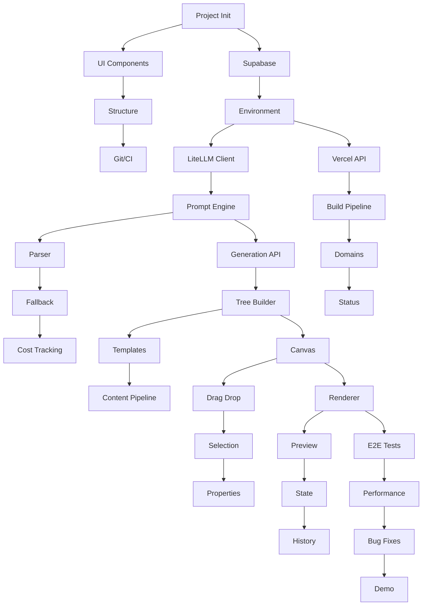

# Aether Development Task Breakdown

## 📈 Progress Tracker

### Overall Progress
- **Start Date**: [x] September 1, 2025
- **Current Day**: [2] Day 2/14 ✅
- **Tasks Completed**: [13] 13/84
- **Current Status**: 🟢 On Track (Ready for Day 3)

### Daily Progress
```
✅ Completed | 🔄 In Progress | ⏸️ Paused | ❌ Blocked | ⏭️ Skipped
```

| Day | Date | Planned Tasks | Completed | Status | Notes |
|-----|------|--------------|-----------|--------|-------|
| 1 | Sept 1 | 6 tasks | 6/6 | ✅ | All Day 1 tasks completed |
| 2 | Sept 2 | 7 tasks | 7/7 | ✅ | AI Integration + Registry complete |
| 3 | | 4 tasks | 1/4 | 🔄 | Task 3.1 completed |
| 4 | | 4 tasks | 0/4 | | |
| 5 | | 4 tasks | 0/4 | | |
| 6 | | 5 tasks | 0/5 | | |
| 7 | | 4 tasks | 0/4 | | |
| 8-9 | | 4 tasks | 0/4 | | |
| 10-11 | | 4 tasks | 0/4 | | |
| 12-13 | | 4 tasks | 0/4 | | |
| 14 | | 4 tasks | 0/4 | | |

### Blocker Log
| Date | Task | Issue | Resolution | Time Lost |
|------|------|-------|------------|----------|
| | | | | |

## Overview
- **Total Duration**: 14 days
- **Daily Hours**: 6-8 hours
- **Total Tasks**: 84 tasks
- **Development Approach**: AI-assisted solo development with LiteLLM
- **MVP Delivery**: Day 7
- **Production Ready**: Day 14

## Week 1: MVP Core (Days 1-7)

### Day 1: Project Foundation ✅
**Goal**: Establish development environment and core infrastructure
**Deliverables**: Configured Next.js app, Supabase connection, Git repository

#### Task 1.1: Project Initialization (30min)
**Status**: [x] Completed ✅
**Type**: Setup
**Priority**: Critical
**Dependencies**: None

**Description**:
Initialize Next.js 14 project with TypeScript, Tailwind CSS, and ESLint configuration. Set up monorepo structure using Turborepo.

**AI Prompt**:
```
Create a Next.js 14 project with App Router, TypeScript, Tailwind CSS, and Turborepo monorepo structure. Include ESLint, Prettier, and Husky for code quality. Use pnpm as package manager.
```

**Acceptance Criteria**:
- [ ] Next.js 14 app created with App Router
- [ ] TypeScript configured
- [ ] Tailwind CSS installed and configured
- [ ] Turborepo structure set up

**Files to Create/Modify**:
- `package.json`
- `turbo.json`
- `apps/web/package.json`
- `apps/web/app/layout.tsx`
- `apps/web/tailwind.config.js`

**Testing**:
- [ ] `pnpm dev` runs successfully
- [ ] TypeScript compilation passes
- [ ] Tailwind styles apply correctly

---

#### Task 1.2: Supabase Setup (45min)
**Status**: [x] Completed ✅
**Actual Time**: 30min
**Type**: Setup
**Priority**: Critical
**Dependencies**: Task 1.1

**Description**:
Configure Supabase project, set up authentication, and create initial database schema for users, sites, and components.

**AI Prompt**:
```
Set up Supabase client for Next.js 14 with authentication. Create database tables for users, sites, components, templates, deployments, and ai_generations with proper RLS policies. Include TypeScript types.
```

**Acceptance Criteria**:
- [ ] Supabase project created
- [ ] Database tables created with RLS
- [ ] Authentication configured
- [ ] TypeScript types generated

**Files to Create/Modify**:
- `packages/database/schema.sql`
- `packages/database/types.ts`
- `apps/web/lib/supabase/client.ts`
- `apps/web/lib/supabase/server.ts`
- `.env.local`

**Testing**:
- [ ] Database connection works
- [ ] Tables created successfully
- [ ] RLS policies active

---

#### Task 1.3: Environment Configuration (15min)
**Status**: [x] Completed ✅
**Actual Time**: 30min
**Type**: Setup
**Priority**: Critical
**Dependencies**: Task 1.2

**Description**:
Create Zod validation for environment variables including LiteLLM configuration. Validate all API keys with type-safe access.

**AI Prompt**:
```
Create environment variable validation with Zod for:
- LiteLLM configuration (API base, key, models)
- Supabase (URL, anon key, service key)
- Vercel (token, team ID)
- Other services

Use the existing .env.local.example as reference.
Create lib/env.ts with proper type validation.
```

**Acceptance Criteria**:
- [x] Zod schema validates all env vars
- [x] Type-safe env access throughout app
- [x] LiteLLM config properly validated
- [x] Error messages for missing vars

**Files to Create/Modify**:
- `lib/env.ts` (create - Zod validation)
- `lib/env.client.ts` (create - client-side vars)
- `lib/env.server.ts` (create - server-side vars)

**Testing**:
- [x] Environment variables validation works
- [x] Missing vars show clear errors
- [x] Type safety enforced
- [x] LiteLLM connection validated

---

#### Task 1.4: UI Component Library Setup (30min)
**Status**: [x] Completed ✅
**Actual Time**: 35min
**Type**: Setup
**Priority**: High
**Dependencies**: Task 1.1

**Description**:
Create base UI components (Button, Input, Card, Modal) following the design system with dark mode support.

**AI Prompt**:
```
Create reusable React components (Button, Input, Card, Modal, Toast) with Tailwind CSS styling, dark mode support, and TypeScript. Follow the Aether design system with primary blue (#3b82f6) and AI purple gradient.
```

**Acceptance Criteria**:
- [x] Core components created
- [x] Dark mode toggle works
- [x] Consistent styling applied
- [x] TypeScript props defined

**Files to Create/Modify**:
- `packages/ui/components/Button.tsx`
- `packages/ui/components/Input.tsx`
- `packages/ui/components/Card.tsx`
- `packages/ui/components/Modal.tsx`
- `packages/ui/index.ts`

**Testing**:
- [x] Components render correctly
- [x] Dark mode switches properly
- [x] Props work as expected

---

#### Task 1.5: Project Structure Organization (30min)
**Status**: [x] Completed ✅
**Actual Time**: 30min
**Type**: Setup
**Priority**: High
**Dependencies**: Task 1.4

**Description**:
Organize project folders for features, establish import aliases, and create initial routing structure.

**AI Prompt**:
```
Set up Next.js 14 app directory structure with routes for dashboard, editor, sites, and API. Configure path aliases (@/components, @/lib, @/hooks) and create layout components.
```

**Acceptance Criteria**:
- [x] Folder structure created
- [x] Import aliases work
- [x] Routes configured
- [x] Layouts implemented

**Files to Create/Modify**:
- `apps/web/app/(dashboard)/layout.tsx`
- `apps/web/app/editor/[id]/page.tsx`
- `apps/web/app/api/ai/generate/route.ts`
- `tsconfig.json`

**Testing**:
- [x] Routes accessible
- [x] Imports resolve correctly
- [x] Layouts render properly

---

#### Task 1.6: Git and CI/CD Setup (30min)
**Status**: [x] Completed ✅
**Actual Time**: 30min
**Type**: Setup
**Priority**: Medium
**Dependencies**: Task 1.5

**Description**:
Initialize Git repository, create GitHub Actions workflow for CI/CD, and configure Vercel deployment.

**AI Prompt**:
```
Set up Git repository with proper .gitignore, create GitHub Actions workflow for linting, testing, and building. Configure automatic Vercel deployment on push to main branch with LiteLLM environment variables.
```

**Acceptance Criteria**:
- [x] Git repository initialized
- [x] GitHub Actions workflow created
- [x] Vercel project connected
- [x] Auto-deploy configured with LiteLLM vars

**Files to Create/Modify**:
- `.gitignore`
- `.github/workflows/ci.yml`
- `vercel.json` (with LiteLLM env vars)

**Testing**:
- [x] Git commits work
- [x] CI pipeline runs
- [x] Vercel deploys successfully

---

### Day 2: AI Integration Core with LiteLLM ✅
**Goal**: Implement unified AI engine using LiteLLM for all model interactions
**Deliverables**: Working LiteLLM proxy integration, prompt system, response parsing, Component Registry integration

#### Task 2.1: LiteLLM Client Enhancement (30min)
**Status**: [x] Completed ✅
**Actual Time**: 30min
**Type**: Feature
**Priority**: Critical
**Dependencies**: Task 1.3
**Actual Time**: ___

**Description**:
Enhance existing LiteLLM client with retry logic, streaming improvements, and comprehensive testing for unified AI model access.

**AI Prompt**:
```
Enhance the existing LiteLLM client in packages/ai-engine/lib/litellm-client.ts:
1. Add retry logic with exponential backoff
2. Improve streaming response handler
3. Add request/response logging middleware
4. Create comprehensive test suite
5. Implement robust health check
6. Configure model routing (claude-4-sonnet, gpt-5-mini, gpt-5 through single endpoint)

Verify all models work through LiteLLM proxy:
- claude-4-sonnet for primary content/analysis
- gpt-5-mini for quick processing
- gpt-5 for image generation
```

**Acceptance Criteria**:
- [ ] LiteLLM client fully configured
- [ ] Retry logic with backoff implemented
- [ ] Streaming support works smoothly
- [ ] Model routing automatic
- [ ] Cost tracking accurate via LiteLLM
- [ ] Health check endpoint functional

**Files to Create/Modify**:
- `packages/ai-engine/lib/litellm-client.ts` (enhance)
- `packages/ai-engine/lib/errors.ts` (create)
- `packages/ai-engine/config.ts` (create)
- `packages/ai-engine/test/client.test.ts` (create)

**Testing**:
- [ ] API calls succeed through LiteLLM
- [ ] Automatic fallback works (claude-4-sonnet → gpt-5-mini)
- [ ] Streaming responses work
- [ ] Cost calculation accurate
- [ ] All models accessible via unified endpoint

---

#### Task 2.2: Prompt Engine with LiteLLM (2hr)
**Status**: [x] Completed ✅
**Actual Time**: 120min
**Type**: Feature
**Priority**: Critical
**Dependencies**: Task 2.1
**Actual Time**: ___

**Description**:
Build sophisticated prompt engineering system that leverages LiteLLM's model routing for optimal results.

**AI Prompt**:
```
Implement a prompt engine using LiteLLM that:
1. Routes prompts to appropriate models via LiteLLM:
   - claude-4-sonnet for site structure and content
   - gpt-5-mini for quick responses and optimization
   - gpt-5 for image generation
2. Enhances prompts with industry-specific templates
3. Generates structured JSON output for site components
4. Includes system prompts for consistent quality
5. Uses LiteLLM's built-in cost tracking

All calls go through packages/ai-engine/lib/litellm-client.ts
```

**Acceptance Criteria**:
- [ ] Prompt routing through LiteLLM works
- [ ] Business context properly extracted
- [ ] JSON output validated with Zod
- [ ] System prompts effective
- [ ] Model selection optimized per task type
- [ ] Cost tracked per generation

**Files to Create/Modify**:
- `packages/ai-engine/prompts/system.ts`
- `packages/ai-engine/prompts/templates.ts`
- `packages/ai-engine/generators/prompt-engine.ts`
- `packages/ai-engine/lib/enhancer.ts`
- `packages/ai-engine/lib/model-router.ts`

**Testing**:
- [ ] Prompts generate valid structures
- [ ] Context extraction accurate
- [ ] Output format consistent
- [ ] Different models used appropriately via LiteLLM
- [ ] Costs tracked correctly

---

#### Task 2.3: AI Response Parser for LiteLLM (1hr)
**Type**: Feature
**Priority**: Critical
**Dependencies**: Task 2.2

**Description**:
Create robust parser for LiteLLM responses that handles different model output formats.

**AI Prompt**:
```
Build a parser that:
1. Handles responses from different models via LiteLLM
2. Validates JSON responses with Zod schemas
3. Converts JSON to React component tree structure
4. Handles malformed responses gracefully
5. Normalizes output differences between claude-4-sonnet and gpt-5-mini
6. Extracts cost information from LiteLLM response metadata
```

**Acceptance Criteria**:
- [ ] JSON parsing reliable across models
- [ ] Component tree valid
- [ ] Error recovery works
- [ ] Validation comprehensive
- [ ] Cost data extracted

**Files to Create/Modify**:
- `packages/ai-engine/parsers/response-parser.ts`
- `packages/ai-engine/schemas/site-structure.ts`
- `packages/ai-engine/lib/validators.ts`
- `packages/ai-engine/lib/normalizer.ts`

**Testing**:
- [ ] Valid responses parse correctly
- [ ] Invalid responses handled
- [ ] Component tree renders
- [ ] Cost tracking accurate

---

#### Task 2.4: Error Handling & LiteLLM Fallback (45min)
**Status**: [x] Completed ✅
**Actual Time**: 45min
**Type**: Feature
**Priority**: High
**Dependencies**: Task 2.3

**Description**:
Implement comprehensive error handling leveraging LiteLLM's automatic model fallback.

**AI Prompt**:
```
Implement error handling system that works with LiteLLM:
1. Create error boundaries for UI components
2. Add user-friendly error messages
3. Configure LiteLLM's automatic fallback chain:
   - Primary: claude-4-sonnet
   - Fallback 1: gpt-5-mini
   - Fallback 2: gpt-4o-mini
4. Add error logging and monitoring
5. Create fallback UI states
6. Track fallback usage for cost optimization

Note: LiteLLM handles model fallback automatically based on config.
```

**Acceptance Criteria**:
- [x] Error boundaries implemented
- [x] User-friendly messages shown
- [x] LiteLLM fallback chain configured
- [x] Recovery mechanisms functional
- [x] Fallback usage tracked

**Files to Create/Modify**:
- `apps/web/components/error-boundary.tsx`
- `packages/ai-engine/lib/error-handler.ts`
- `packages/ai-engine/lib/fallback-config.ts`
- `apps/web/components/error-states.tsx`

**Testing**:
- [x] Error boundaries catch errors
- [x] LiteLLM fallback works automatically
- [x] System remains stable
- [x] Users informed of degraded service

---

#### Task 2.5: Usage & Cost Tracking with LiteLLM (30min)
**Status**: [x] Completed ✅
**Actual Time**: 45min
**Type**: Feature
**Priority**: Medium
**Dependencies**: Task 2.4

**Description**:
Implement usage tracking leveraging LiteLLM's built-in cost calculation across all models.

**AI Prompt**:
```
Create usage tracking system using LiteLLM's cost tracking:
1. Extract cost data from LiteLLM response metadata
2. Track costs per model (claude-4-sonnet, gpt-5-mini, gpt-5)
3. Store usage metrics in Supabase database
4. Implement tier-based quotas (Free/Starter/Pro/Business)
5. Show real-time usage dashboard with model breakdown
6. Add cost estimation before generation

LiteLLM provides automatic cost calculation for all supported models.
```

**Acceptance Criteria**:
- [x] Token counting accurate via LiteLLM
- [x] Costs calculated correctly per model
- [x] Database schema created (will be connected in Task 2.6)
- [x] Quota system implemented
- [x] Model usage breakdown dashboard created

**Files to Create/Modify**:
- `packages/ai-engine/lib/cost-tracker.ts`
- `apps/web/lib/usage.ts`
- `apps/web/api/ai/usage/route.ts`
- `apps/web/components/UsageDashboard.tsx`

**Testing**:
- [ ] Costs match LiteLLM calculations
- [ ] Quotas prevent overuse
- [ ] Database records accurate
- [ ] Dashboard shows correct breakdown

---

#### Task 2.6: Redis Caching for LiteLLM (1hr)
**Type**: Feature
**Priority**: High
**Dependencies**: Task 2.5
**Status**: [x] Completed ✅
**Actual Time**: 45min

**Description**:
Implement Redis caching for LiteLLM responses to reduce costs and improve speed.

**AI Prompt**:
```
Implement Redis caching system for LiteLLM:
1. Set up Upstash Redis client
2. Create cache key from prompt + model combination
3. Cache successful LiteLLM responses
4. Add TTL management (1 hour for AI responses)
5. Track cache statistics and cost savings
6. Skip cache for image generation (gpt-5)

Include cache invalidation strategies.
```

**Acceptance Criteria**:
- [x] Redis connection established
- [x] Cache key generation works
- [x] Cache hit/miss tracked
- [x] TTL management working
- [x] Cost savings calculated

**Files to Create/Modify**:
- `packages/ai-engine/lib/cache.ts`
- `packages/ai-engine/lib/redis-client.ts`
- `apps/web/lib/cache-stats.ts`

**Testing**:
- [ ] Same prompt hits cache
- [ ] TTL expiration works
- [ ] Cache invalidation works
- [ ] Cost reduction verified

---

#### Task 2.7: Component Registry Infrastructure (1.5hr)
**Status**: [x] Completed ✅
**Actual Time**: 90min
**Type**: Feature
**Priority**: Critical
**Dependencies**: Task 2.6

**Description**:
Component Registry 시스템 구축으로 AI 생성 효율성 극대화. 미리 정의된 고품질 컴포넌트 라이브러리 구축.

**AI Prompt**:
```
Build Component Registry system:
1. Create packages/component-registry with 20 core components
2. Implement component metadata system (category, variants, props schema)
3. Build registry API (register, lookup, search by category/keywords)
4. Add performance and accessibility metrics
5. Create component preview system

Core Components to implement:
- Hero sections (3 variants): centered, split, video-bg
- Features (3 variants): grid, cards, list  
- CTA (2 variants): simple, with-image
- Headers (3 variants): simple, with-cta, mega-menu
- Footers (3 variants): simple, links, newsletter
- Pricing (2 variants): simple, comparison
- Testimonials (2 variants): cards, carousel
- Contact (2 variants): simple, with-map

Use existing components table in database for storage.
```

**Acceptance Criteria**:
- [ ] 20 core components implemented
- [ ] Component metadata system works
- [ ] Registry API functional
- [ ] All components tested and validated
- [ ] Performance metrics tracked

**Files to Create/Modify**:
- `packages/component-registry/` (new package)
- `packages/component-registry/src/registry.ts`
- `packages/component-registry/src/components/`
- `packages/component-registry/src/metadata.ts`
- Update database components table

**Testing**:
- [ ] All components render correctly
- [ ] Registry lookup works
- [ ] Metadata accurate
- [ ] Performance within targets

---

#### Task 2.8: AI Selection Engine Integration (1hr)
**Status**: [x] Completed ✅
**Actual Time**: 90min
**Type**: Feature
**Priority**: Critical
**Dependencies**: Task 2.7

**Description**:
AI가 컴포넌트를 직접 생성하지 않고 Registry에서 선택하도록 변경. 토큰 사용량 90% 절감 목표.

**AI Prompt**:
```
Modify AI generation pipeline to use Component Registry:
1. Update generateSiteStructure to select components (not generate)
2. Create selectComponents function for AI component selection
3. Implement Component Composer for assembly
4. Modify prompts: "Select component IDs and generate props only"
5. Add fallback to direct generation for edge cases

New prompt strategy:
- Input: "Create a SaaS landing page"
- Output: {"selections": [{"componentId": "hero-split", "props": {...}}]}
- NOT: Full component JSON structure

Expected token reduction: 20,000 → 2,000 tokens per site
```

**Acceptance Criteria**:
- [x] AI selects components instead of generating
- [x] Token usage reduced by >80%
- [x] Generation time under 15 seconds
- [x] Component assembly works correctly
- [x] Fallback mechanism functional

**Files to Create/Modify**:
- `packages/ai-engine/generators/site-generator.ts` [MODIFIED]
- `packages/ai-engine/selectors/component-selector.ts` [NEW]
- `packages/ai-engine/composers/site-composer.ts` [NEW]
- `packages/ai-engine/prompts/selection-prompts.ts` [NEW]

**Testing**:
- [x] Component selection works
- [x] Assembly produces valid sites
- [x] Token usage verified
- [x] Speed improvement confirmed

---

### Day 3: Site Generation Engine
**Goal**: Build core site generation logic
**Deliverables**: Component tree generation, template system, content pipeline

#### Task 3.1: Site Generation API (1hr) ✅
**Type**: Feature
**Priority**: Critical
**Dependencies**: Task 2.2
**Status**: [x] Completed ✅
**Actual Time**: 90min

**Description**:
Create API endpoint for site generation that orchestrates the entire generation pipeline.

**AI Prompt**:
```
Build Next.js 14 API route for site generation:
1. Accept user prompt and preferences
2. Generate site structure with AI
3. Create component tree
4. Store in database
5. Return site ID and preview
Use Edge Runtime for performance.
```

**Acceptance Criteria**:
- [x] API endpoint works
- [x] Generation pipeline complete
- [x] Database storage successful
- [x] Response under 30 seconds

**Files to Create/Modify**:
- `apps/web/app/api/ai/generate/route.ts` ✅
- `apps/web/app/api/ai/status/[id]/route.ts` ✅
- `packages/ai-engine/generators/site-generator.ts` ✅

**Testing**:
- [x] API accepts requests
- [x] Sites generated successfully
- [x] Status updates work

---

#### Task 3.2: Component Tree Builder (2hr)
**Status**: [x] Completed ✅
**Actual Time**: 120min
**Type**: Feature
**Priority**: Critical
**Dependencies**: Task 3.1

**Description**:
Implement logic to build hierarchical component trees from AI-generated structures.

**AI Prompt**:
```
Create a component tree builder that:
1. Converts AI JSON to nested component structure
2. Assigns unique IDs to each component
3. Manages parent-child relationships
4. Includes layout and styling information
5. Supports responsive breakpoints
Ensure tree is renderable in React.
```

**Acceptance Criteria**:
- [x] Tree structure valid
- [x] Components properly nested
- [x] IDs unique and trackable
- [x] Styling applied correctly

**Files to Create/Modify**:
- `packages/ai-engine/builders/component-tree.ts` ✅
- `packages/ai-engine/types/components.ts` ✅
- `packages/ai-engine/lib/id-generator.ts` ✅

**Testing**:
- [x] Trees build correctly
- [x] React can render output
- [x] Relationships maintained

---

#### Task 3.3: Template System (1.5hr)
**Type**: Feature
**Priority**: High
**Dependencies**: Task 3.2

**Description**:
Create template system with 5 initial templates (SaaS, Portfolio, E-commerce, Blog, Restaurant).

**AI Prompt**:
```
Build a template system with:
1. Base templates for 5 industries
2. Component library for each template
3. Customization options (colors, fonts)
4. AI hints for better generation
5. Template selection logic
Include modern, responsive designs using Tailwind CSS.
```

**Acceptance Criteria**:
- [ ] 5 templates created
- [ ] Templates customizable
- [ ] AI can use templates
- [ ] Designs responsive

**Files to Create/Modify**:
- `packages/templates/saas.ts`
- `packages/templates/portfolio.ts`
- `packages/templates/ecommerce.ts`
- `packages/templates/blog.ts`
- `packages/templates/restaurant.ts`

**Testing**:
- [ ] Each template renders
- [ ] Customization works
- [ ] Mobile responsive

---

#### Task 3.4: Content Generation Pipeline (1hr)
**Type**: Feature
**Priority**: High
**Dependencies**: Task 3.3

**Description**:
Build pipeline for generating and optimizing website content using AI.

**AI Prompt**:
```
Create content generation pipeline:
1. Generate headlines and copy based on business
2. Create SEO-optimized meta descriptions
3. Generate appropriate CTAs
4. Ensure consistent tone/voice
5. Support multiple languages
Use gpt-5-mini for quick content optimization.
```

**Acceptance Criteria**:
- [ ] Content relevant to business
- [ ] SEO optimization applied
- [ ] CTAs compelling
- [ ] Tone consistent

**Files to Create/Modify**:
- `packages/ai-engine/generators/content-generator.ts`
- `packages/ai-engine/lib/seo-optimizer.ts`
- `packages/ai-engine/lib/content-enhancer.ts`

**Testing**:
- [ ] Content quality high
- [ ] SEO scores good
- [ ] Multiple sections covered

---

### Day 4: Visual Editor Foundation
**Goal**: Build drag-and-drop visual editor
**Deliverables**: Canvas component, selection tools, property panel

#### Task 4.1: Canvas Component (2hr)
**Type**: Feature
**Priority**: Critical
**Dependencies**: Task 3.2

**Description**:
Implement main canvas component for visual editing with grid system and rulers.

**AI Prompt**:
```
Build a React canvas component for visual editing:
1. Render component tree visually
2. Support drag-and-drop positioning
3. Show grid and snap-to-grid
4. Display rulers and guides
5. Handle zoom and pan
Use React and Framer Motion for smooth interactions.
```

**Acceptance Criteria**:
- [ ] Components render on canvas
- [ ] Grid system works
- [ ] Zoom/pan functional
- [ ] Performance smooth

**Files to Create/Modify**:
- `packages/editor-core/canvas/Canvas.tsx`
- `packages/editor-core/canvas/Grid.tsx`
- `packages/editor-core/canvas/Rulers.tsx`
- `packages/editor-core/canvas/viewport.ts`

**Testing**:
- [ ] Canvas renders components
- [ ] Interactions smooth
- [ ] Grid snapping works

---

#### Task 4.2: Drag and Drop System (1.5hr)
**Type**: Feature
**Priority**: Critical
**Dependencies**: Task 4.1

**Description**:
Implement drag-and-drop functionality for moving and reordering components.

**AI Prompt**:
```
Implement drag-and-drop system:
1. Make components draggable
2. Support reordering in tree
3. Enable component insertion
4. Show drop zones
5. Provide visual feedback
Use @dnd-kit/sortable for smooth DnD.
```

**Acceptance Criteria**:
- [ ] Components draggable
- [ ] Reordering works
- [ ] Drop zones visible
- [ ] Feedback clear

**Files to Create/Modify**:
- `packages/editor-core/dnd/DragDropContext.tsx`
- `packages/editor-core/dnd/Draggable.tsx`
- `packages/editor-core/dnd/Droppable.tsx`

**Testing**:
- [ ] Drag and drop smooth
- [ ] Tree updates correctly
- [ ] No components lost

---

#### Task 4.3: Selection Tools (1hr)
**Type**: Feature
**Priority**: High
**Dependencies**: Task 4.2

**Description**:
Create selection system with multi-select, selection box, and keyboard shortcuts.

**AI Prompt**:
```
Build selection tools:
1. Click to select components
2. Multi-select with Ctrl/Cmd
3. Selection box with drag
4. Keyboard navigation
5. Visual selection indicators
Include resize handles on selected items.
```

**Acceptance Criteria**:
- [ ] Single select works
- [ ] Multi-select functional
- [ ] Selection box works
- [ ] Keyboard shortcuts active

**Files to Create/Modify**:
- `packages/editor-core/selection/SelectionManager.ts`
- `packages/editor-core/selection/SelectionBox.tsx`
- `packages/editor-core/selection/ResizeHandles.tsx`

**Testing**:
- [ ] Selection accurate
- [ ] Multi-select works
- [ ] Shortcuts responsive

---

#### Task 4.4: Property Panel (1hr)
**Type**: Feature
**Priority**: High
**Dependencies**: Task 4.3

**Description**:
Build property panel for editing component attributes and styles.

**AI Prompt**:
```
Create property panel UI:
1. Show selected component properties
2. Edit text content inline
3. Modify styles (colors, spacing, typography)
4. Adjust responsive settings
5. Configure animations
Use form controls with instant preview.
```

**Acceptance Criteria**:
- [ ] Properties editable
- [ ] Changes apply instantly
- [ ] Responsive settings work
- [ ] UI intuitive

**Files to Create/Modify**:
- `packages/editor-core/panels/PropertyPanel.tsx`
- `packages/editor-core/controls/ColorPicker.tsx`
- `packages/editor-core/controls/SpacingControl.tsx`
- `packages/editor-core/controls/TypographyControl.tsx`

**Testing**:
- [ ] Properties update correctly
- [ ] Preview instant
- [ ] No lag in updates

---

### Day 5: Editor Integration
**Goal**: Connect editor with generation engine
**Deliverables**: Component rendering, real-time preview, state management

#### Task 5.1: Component Renderer (2hr)
**Type**: Feature
**Priority**: Critical
**Dependencies**: Task 4.1

**Description**:
Build system to render AI-generated components in the editor canvas.

**AI Prompt**:
```
Create component rendering engine:
1. Dynamically render component tree
2. Apply styles and props
3. Handle nested components
4. Support custom components
5. Enable hot reload on changes
Use React Server Components where applicable.
```

**Acceptance Criteria**:
- [ ] Components render correctly
- [ ] Styles applied properly
- [ ] Nesting works
- [ ] Updates instant

**Files to Create/Modify**:
- `packages/editor-core/renderer/ComponentRenderer.tsx`
- `packages/editor-core/renderer/DynamicComponent.tsx`
- `packages/editor-core/renderer/StyleInjector.tsx`

**Testing**:
- [ ] All component types render
- [ ] Styles apply correctly
- [ ] Performance acceptable

---

#### Task 5.2: Real-time Preview (1hr)
**Type**: Feature
**Priority**: High
**Dependencies**: Task 5.1

**Description**:
Implement live preview that updates as user makes changes in editor.

**AI Prompt**:
```
Build real-time preview system:
1. Mirror canvas changes instantly
2. Show responsive views (mobile/tablet/desktop)
3. Support hot reload
4. Maintain scroll position
5. Sync with editor state
Use iframe for isolation.
```

**Acceptance Criteria**:
- [ ] Preview updates instantly
- [ ] Responsive views work
- [ ] No flicker on updates
- [ ] State synchronized

**Files to Create/Modify**:
- `apps/web/app/preview/[id]/page.tsx`
- `packages/editor-core/preview/PreviewFrame.tsx`
- `packages/editor-core/preview/DeviceFrame.tsx`

**Testing**:
- [ ] Changes reflect immediately
- [ ] All devices show correctly
- [ ] Performance smooth

---

#### Task 5.3: State Management (1hr)
**Type**: Feature
**Priority**: Critical
**Dependencies**: Task 5.2

**Description**:
Set up Zustand store for editor state with undo/redo functionality.

**AI Prompt**:
```
Implement Zustand state management:
1. Store component tree state
2. Track selection state
3. Manage editor settings
4. Implement undo/redo with Immer
5. Persist state to localStorage
Include DevTools for debugging.
```

**Acceptance Criteria**:
- [ ] State updates properly
- [ ] Undo/redo works
- [ ] State persists
- [ ] DevTools integration

**Files to Create/Modify**:
- `packages/editor-core/store/editorStore.ts`
- `packages/editor-core/store/historyStore.ts`
- `packages/editor-core/store/selectionStore.ts`

**Testing**:
- [ ] State management reliable
- [ ] Undo/redo accurate
- [ ] No state loss

---

#### Task 5.4: History System (45min)
**Type**: Feature
**Priority**: Medium
**Dependencies**: Task 5.3

**Description**:
Build comprehensive undo/redo system with command pattern.

**AI Prompt**:
```
Create history management:
1. Track all editor actions
2. Implement command pattern
3. Support batch operations
4. Limit history size
5. Show history timeline
Enable Ctrl+Z/Ctrl+Y shortcuts.
```

**Acceptance Criteria**:
- [ ] All actions undoable
- [ ] Batch operations handled
- [ ] Shortcuts work
- [ ] Memory efficient

**Files to Create/Modify**:
- `packages/editor-core/history/HistoryManager.ts`
- `packages/editor-core/history/commands.ts`
- `packages/editor-core/components/HistoryPanel.tsx`

**Testing**:
- [ ] Undo/redo reliable
- [ ] Complex operations handled
- [ ] Performance maintained

---

### Day 6: Deployment System
**Goal**: Implement one-click deployment to Vercel
**Deliverables**: Build system, deployment pipeline, domain management

#### Task 6.1: Vercel API Integration (1hr)
**Type**: Feature
**Priority**: Critical
**Dependencies**: Task 1.3

**Description**:
Integrate Vercel deployment API for automated site deployment.

**AI Prompt**:
```
Integrate Vercel API:
1. Create deployment projects
2. Upload build files
3. Configure environment variables
4. Set up custom domains
5. Monitor deployment status
Use Vercel REST API with proper auth.
```

**Acceptance Criteria**:
- [ ] API connection works
- [ ] Projects created successfully
- [ ] Deployments trigger
- [ ] Status tracking works

**Files to Create/Modify**:
- `packages/deployment/vercel-client.ts`
- `packages/deployment/types.ts`
- `apps/web/app/api/deploy/route.ts`

**Testing**:
- [ ] Deployments succeed
- [ ] Status updates accurate
- [ ] Errors handled

---

#### Task 6.2: Build Pipeline (1.5hr)
**Type**: Feature
**Priority**: Critical
**Dependencies**: Task 6.1

**Description**:
Create build pipeline that converts editor output to deployable Next.js site.

**AI Prompt**:
```
Build deployment pipeline:
1. Convert component tree to Next.js pages
2. Generate static assets
3. Optimize images and code
4. Create production build
5. Bundle for deployment
Output deployable Next.js project.
```

**Acceptance Criteria**:
- [ ] Valid Next.js output
- [ ] Build optimized
- [ ] Assets included
- [ ] Deployment ready

**Files to Create/Modify**:
- `packages/deployment/builder.ts`
- `packages/deployment/optimizer.ts`
- `packages/deployment/bundler.ts`

**Testing**:
- [ ] Builds complete successfully
- [ ] Output valid Next.js
- [ ] Performance optimized

---

#### Task 6.3: Domain Management (45min)
**Type**: Feature
**Priority**: Medium
**Dependencies**: Task 6.2

**Description**:
Implement custom domain connection and SSL certificate management.

**AI Prompt**:
```
Create domain management:
1. Connect custom domains via Vercel
2. Verify domain ownership
3. Configure DNS records
4. Provision SSL certificates
5. Handle subdomain routing
Show DNS configuration instructions.
```

**Acceptance Criteria**:
- [ ] Domains connect successfully
- [ ] SSL certificates provision
- [ ] DNS instructions clear
- [ ] Verification works

**Files to Create/Modify**:
- `packages/deployment/domain-manager.ts`
- `apps/web/app/api/deploy/domain/route.ts`
- `apps/web/components/DomainSettings.tsx`

**Testing**:
- [ ] Domain connection works
- [ ] SSL active
- [ ] Instructions helpful

---

#### Task 6.4: Deployment Status Tracking (30min)
**Type**: Feature
**Priority**: Medium
**Dependencies**: Task 6.3

**Description**:
Build real-time deployment status tracking with progress indicators.

**AI Prompt**:
```
Implement deployment tracking:
1. Show real-time progress
2. Display build logs
3. Handle errors gracefully
4. Send completion notifications
5. Track deployment history
Use Supabase realtime for updates.
```

**Acceptance Criteria**:
- [ ] Progress shown real-time
- [ ] Logs accessible
- [ ] Errors displayed clearly
- [ ] History maintained

**Files to Create/Modify**:
- `apps/web/components/DeploymentStatus.tsx`
- `apps/web/hooks/useDeployment.ts`
- `packages/deployment/status-tracker.ts`

**Testing**:
- [ ] Status updates live
- [ ] Logs display correctly
- [ ] History accurate

---

#### Task 6.5: Rate Limiting 구현 (45min)
**Type**: Security
**Priority**: Critical
**Dependencies**: Task 6.4

**Description**:
Upstash Redis를 사용한 API rate limiting으로 서비스 보호 및 비용 통제.

**AI Prompt**:
```
Implement API rate limiting with Upstash:
1. Create middleware for rate limiting
2. Configure tier-based limits (Free: 10/hr, Starter: 100/hr, Pro: 1000/hr)
3. Add sliding window algorithm
4. Return proper 429 responses with headers
5. Implement bypass for Business tier
Include X-RateLimit-* headers in responses.
```

**Acceptance Criteria**:
- [ ] Rate limit 미들웨어 작동
- [ ] 티어별 제한 적용
- [ ] 429 응답 반환
- [ ] Rate limit 헤더 포함
- [ ] Business 티어 무제한

**Files to Create/Modify**:
- `apps/web/middleware.ts`
- `apps/web/lib/rate-limit.ts`
- `apps/web/lib/constants/limits.ts`

**Testing**:
- [ ] Rate limit 초과 시 429 반환
- [ ] 헤더 정보 정확
- [ ] 티어별 제한 확인

---

### Day 7: Polish & Testing
**Goal**: Complete MVP with testing and bug fixes
**Deliverables**: E2E tests, performance optimization, demo preparation

#### Task 7.1: E2E Flow Testing (1.5hr)
**Type**: Testing
**Priority**: Critical
**Dependencies**: All Day 1-6 tasks

**Description**:
Write comprehensive E2E tests for complete user journey from generation to deployment.

**AI Prompt**:
```
Create Playwright E2E tests:
1. Test site generation flow
2. Test editor interactions
3. Test deployment process
4. Test responsive views
5. Test error scenarios
Cover happy path and edge cases.
```

**Acceptance Criteria**:
- [ ] All flows tested
- [ ] Tests pass consistently
- [ ] Edge cases covered
- [ ] CI integration works

**Files to Create/Modify**:
- `e2e/generation.spec.ts`
- `e2e/editor.spec.ts`
- `e2e/deployment.spec.ts`
- `playwright.config.ts`

**Testing**:
- [ ] Tests run successfully
- [ ] Coverage adequate
- [ ] No flaky tests

---

#### Task 7.2: Performance Optimization (1hr)
**Type**: Optimization
**Priority**: High
**Dependencies**: Task 7.1

**Description**:
Optimize application performance for sub-2s load times and 60fps interactions.

**AI Prompt**:
```
Optimize performance:
1. Implement code splitting
2. Add lazy loading
3. Optimize bundle size
4. Cache API responses
5. Use React.memo strategically
Target <100KB initial JS, <2s TTI.
```

**Acceptance Criteria**:
- [ ] Load time <2 seconds
- [ ] Bundle size optimized
- [ ] Smooth 60fps interactions
- [ ] Lighthouse score >90

**Files to Create/Modify**:
- `apps/web/next.config.js`
- Various component files for optimization

**Testing**:
- [ ] Performance metrics met
- [ ] No regression in functionality
- [ ] User experience smooth

---

#### Task 7.3: Bug Fixes & Refinements (2hr)
**Type**: Bug Fix
**Priority**: High
**Dependencies**: Task 7.2

**Description**:
Fix identified bugs, improve UX, and refine UI elements based on testing.

**AI Prompt**:
```
Address bug fixes and refinements:
1. Fix any broken flows
2. Improve error messages
3. Enhance loading states
4. Polish UI animations
5. Ensure mobile responsiveness
Focus on user experience quality.
```

**Acceptance Criteria**:
- [ ] Critical bugs fixed
- [ ] UX improved
- [ ] Mobile experience good
- [ ] Animations smooth

**Files to Create/Modify**:
- Various files based on identified issues

**Testing**:
- [ ] No critical bugs
- [ ] UX flows smooth
- [ ] Mobile works well

---

#### Task 7.4: Demo & Documentation (1hr)
**Type**: Documentation
**Priority**: Medium
**Dependencies**: Task 7.3

**Description**:
Prepare demo site, create getting started guide, and record demo video.

**AI Prompt**:
```
Prepare demo materials:
1. Create impressive demo sites
2. Write getting started guide
3. Document API endpoints
4. Create feature showcase
5. Prepare presentation deck
Focus on wow factor for launch.
```

**Acceptance Criteria**:
- [ ] Demo sites impressive
- [ ] Documentation clear
- [ ] Video recorded
- [ ] Ready for presentation

**Files to Create/Modify**:
- `README.md`
- `docs/getting-started.md`
- `docs/api.md`

**Testing**:
- [ ] Demo runs smoothly
- [ ] Docs accurate
- [ ] Video quality good

---

## Week 2: Production Ready (Days 8-14)

### Day 8-9: User System
**Goal**: Implement authentication and user management
**Deliverables**: Auth system, user dashboard, project management

#### Task 8.1: Authentication Implementation (2hr)
**Type**: Feature
**Priority**: Critical
**Dependencies**: Task 1.2

**Description**:
Implement Supabase authentication with email/password and OAuth providers.

**AI Prompt**:
```
Set up authentication:
1. Email/password signup/login
2. Google and GitHub OAuth
3. Password reset flow
4. Email verification
5. Session management
Use Supabase Auth with Next.js middleware.
```

**Acceptance Criteria**:
- [ ] Auth flows work
- [ ] OAuth providers connected
- [ ] Sessions persist
- [ ] Security solid

**Files to Create/Modify**:
- `apps/web/app/(auth)/login/page.tsx`
- `apps/web/app/(auth)/signup/page.tsx`
- `apps/web/middleware.ts`
- `apps/web/lib/auth.ts`

---

#### Task 8.2: User Dashboard (2hr)
**Type**: Feature
**Priority**: High
**Dependencies**: Task 8.1

**Description**:
Create user dashboard showing sites, usage stats, and quick actions.

**AI Prompt**:
```
Build user dashboard:
1. Display user's sites grid
2. Show AI usage statistics
3. Quick action buttons
4. Recent activity feed
5. Subscription status
Use responsive grid layout.
```

**Acceptance Criteria**:
- [ ] Sites displayed nicely
- [ ] Stats accurate
- [ ] Actions work
- [ ] Mobile responsive

**Files to Create/Modify**:
- `apps/web/app/(dashboard)/dashboard/page.tsx`
- `apps/web/components/SiteCard.tsx`
- `apps/web/components/UsageStats.tsx`

---

#### Task 8.3: Project Management (2hr)
**Type**: Feature
**Priority**: High
**Dependencies**: Task 8.2

**Description**:
Implement CRUD operations for user's sites with search and filtering.

**AI Prompt**:
```
Create project management:
1. List user's sites with pagination
2. Search and filter options
3. Duplicate site feature
4. Delete with confirmation
5. Bulk operations
Include optimistic updates.
```

**Acceptance Criteria**:
- [ ] CRUD operations work
- [ ] Search/filter functional
- [ ] Bulk actions work
- [ ] Performance good

**Files to Create/Modify**:
- `apps/web/app/(dashboard)/sites/page.tsx`
- `apps/web/components/SiteList.tsx`
- `apps/web/hooks/useSites.ts`

---

#### Task 9.1: User Settings (1.5hr)
**Type**: Feature
**Priority**: Medium
**Dependencies**: Task 8.3

**Description**:
Build user settings page for profile, preferences, and API keys.

**AI Prompt**:
```
Create settings page:
1. Profile information edit
2. Notification preferences
3. API key management
4. Theme preferences
5. Language settings
Use tabbed interface.
```

**Acceptance Criteria**:
- [ ] Settings save correctly
- [ ] API keys secure
- [ ] Preferences apply
- [ ] UI clean

**Files to Create/Modify**:
- `apps/web/app/(dashboard)/settings/page.tsx`
- `apps/web/components/SettingsTabs.tsx`
- `apps/web/components/ApiKeyManager.tsx`

---

### Day 10-11: AI Enhancement
**Goal**: Improve AI capabilities and add advanced features
**Deliverables**: Component generator, prompt optimization, multi-language support

#### Task 10.1: AI Component Generator (2hr)
**Type**: Feature
**Priority**: High
**Dependencies**: Task 2.2

**Description**:
Build AI system to generate custom React components from descriptions.

**AI Prompt**:
```
Create AI component generator:
1. Accept natural language descriptions
2. Generate React component code
3. Include TypeScript types
4. Add Tailwind styling
5. Support interactive components
Output ready-to-use components.
```

**Acceptance Criteria**:
- [ ] Components generate correctly
- [ ] Code quality high
- [ ] Types accurate
- [ ] Styling applied

**Files to Create/Modify**:
- `packages/ai-engine/generators/component-generator.ts`
- `apps/web/app/api/ai/component/route.ts`
- `apps/web/components/ComponentGenerator.tsx`

---

#### Task 10.2: Prompt Optimization (1.5hr)
**Type**: Optimization
**Priority**: Medium
**Dependencies**: Task 10.1

**Description**:
Enhance prompt system with fine-tuning and context improvements.

**AI Prompt**:
```
Optimize prompt system:
1. Add few-shot examples
2. Implement prompt caching
3. Context window management
4. Industry-specific prompts
5. A/B test prompts
Improve generation quality by 30%.
```

**Acceptance Criteria**:
- [ ] Quality improved
- [ ] Caching works
- [ ] Context managed well
- [ ] A/B testing active

**Files to Create/Modify**:
- `packages/ai-engine/prompts/optimizer.ts`
- `packages/ai-engine/lib/prompt-cache.ts`
- `packages/ai-engine/lib/ab-test.ts`

---

#### Task 11.1: Multi-language Support (2hr)
**Type**: Feature
**Priority**: Medium
**Dependencies**: Task 10.2

**Description**:
Add support for generating sites in multiple languages.

**AI Prompt**:
```
Implement multi-language:
1. Detect user language preference
2. Generate content in target language
3. RTL language support
4. Locale-specific formatting
5. Translation management
Support 10 major languages initially.
```

**Acceptance Criteria**:
- [ ] Languages detected
- [ ] Content localized
- [ ] RTL works
- [ ] Quality maintained

**Files to Create/Modify**:
- `packages/ai-engine/lib/translator.ts`
- `packages/ai-engine/lib/locale.ts`
- `apps/web/lib/i18n.ts`

---

#### Task 11.2: SEO Optimization (1.5hr)
**Type**: Feature
**Priority**: High
**Dependencies**: Task 11.1

**Description**:
Enhance generated sites with advanced SEO optimization.

**AI Prompt**:
```
Implement SEO features:
1. Generate meta tags
2. Create sitemaps
3. Optimize content structure
4. Add schema markup
5. Performance optimization
Target 90+ SEO scores.
```

**Acceptance Criteria**:
- [ ] Meta tags complete
- [ ] Sitemaps generated
- [ ] Schema markup added
- [ ] Scores improved

**Files to Create/Modify**:
- `packages/ai-engine/lib/seo.ts`
- `packages/deployment/seo-optimizer.ts`
- `apps/web/components/SeoSettings.tsx`

---

### Day 12-13: Business Features
**Goal**: Add monetization and collaboration features
**Deliverables**: Subscription system, template marketplace, analytics

#### Task 12.1: Subscription System (2hr)
**Type**: Feature
**Priority**: Critical
**Dependencies**: Task 8.1

**Description**:
Implement subscription tiers with Stripe integration.

**AI Prompt**:
```
Build subscription system:
1. Free/Starter/Pro/Business tiers
2. Stripe payment integration
3. Usage quota enforcement
4. Billing management
5. Invoice generation
Handle upgrades/downgrades smoothly.
```

**Acceptance Criteria**:
- [ ] Payments work
- [ ] Quotas enforced
- [ ] Billing accurate
- [ ] Upgrades smooth

**Files to Create/Modify**:
- `apps/web/app/api/stripe/webhook/route.ts`
- `apps/web/app/(dashboard)/billing/page.tsx`
- `apps/web/lib/stripe.ts`

---

#### Task 12.2: Template Marketplace (2hr)
**Type**: Feature
**Priority**: Medium
**Dependencies**: Task 3.3

**Description**:
Create marketplace for premium templates with creator revenue sharing.

**AI Prompt**:
```
Build template marketplace:
1. Browse/search templates
2. Preview functionality
3. Purchase flow
4. Creator dashboard
5. Revenue tracking
Include rating system.
```

**Acceptance Criteria**:
- [ ] Templates browsable
- [ ] Purchase works
- [ ] Creators can upload
- [ ] Revenue tracked

**Files to Create/Modify**:
- `apps/web/app/marketplace/page.tsx`
- `apps/web/components/TemplateGrid.tsx`
- `apps/web/app/api/marketplace/route.ts`

---

#### Task 13.1: Analytics Dashboard (2hr)
**Type**: Feature
**Priority**: Medium
**Dependencies**: Task 12.1

**Description**:
Build analytics dashboard for site performance and visitor tracking.

**AI Prompt**:
```
Create analytics dashboard:
1. Page view tracking
2. Visitor analytics
3. Conversion tracking
4. Performance metrics
5. Export reports
Use charts for visualization.
```

**Acceptance Criteria**:
- [ ] Tracking accurate
- [ ] Charts informative
- [ ] Exports work
- [ ] Real-time updates

**Files to Create/Modify**:
- `apps/web/app/(dashboard)/analytics/page.tsx`
- `apps/web/components/AnalyticsCharts.tsx`
- `apps/web/lib/analytics.ts`

---

#### Task 13.2: Collaboration Features (1.5hr)
**Type**: Feature
**Priority**: Low
**Dependencies**: Task 13.1

**Description**:
Add basic collaboration with share links and comments.

**AI Prompt**:
```
Implement collaboration:
1. Generate share links
2. View-only access
3. Comment system
4. Version history
5. Activity feed
Focus on async collaboration.
```

**Acceptance Criteria**:
- [ ] Sharing works
- [ ] Comments functional
- [ ] History tracked
- [ ] Permissions enforced

**Files to Create/Modify**:
- `apps/web/components/ShareModal.tsx`
- `apps/web/components/Comments.tsx`
- `apps/web/lib/collaboration.ts`

---

### Day 14: Launch Preparation
**Goal**: Prepare for production launch
**Deliverables**: Production deployment, monitoring, documentation

#### Task 14.1: Production Deployment (1.5hr)
**Type**: Deployment
**Priority**: Critical
**Dependencies**: All previous tasks

**Description**:
Deploy application to production with all services configured.

**AI Prompt**:
```
Production deployment:
1. Configure production env
2. Set up database migrations
3. Deploy to Vercel
4. Configure custom domain
5. Set up CDN
Ensure zero downtime.
```

**Acceptance Criteria**:
- [ ] App deployed
- [ ] All services connected
- [ ] Domain active
- [ ] Performance good

**Files to Create/Modify**:
- `.env.production`
- `vercel.json`
- Production configurations

---

#### Task 14.2: Monitoring Setup (1hr)
**Type**: Infrastructure
**Priority**: High
**Dependencies**: Task 14.1

**Description**:
Set up monitoring, error tracking, and alerting.

**AI Prompt**:
```
Configure monitoring:
1. Sentry error tracking
2. Vercel Analytics
3. Uptime monitoring
4. Performance alerts
5. Cost tracking
Set up alert thresholds.
```

**Acceptance Criteria**:
- [ ] Errors tracked
- [ ] Analytics working
- [ ] Alerts configured
- [ ] Dashboards created

**Files to Create/Modify**:
- `apps/web/lib/monitoring.ts`
- Sentry configuration
- Alert configurations

---

#### Task 14.3: Documentation Finalization (1hr)
**Type**: Documentation
**Priority**: Medium
**Dependencies**: Task 14.2

**Description**:
Complete all documentation for launch.

**AI Prompt**:
```
Finalize documentation:
1. API documentation
2. User guide
3. Developer docs
4. FAQ section
5. Video tutorials
Make it comprehensive and clear.
```

**Acceptance Criteria**:
- [ ] Docs complete
- [ ] Examples included
- [ ] Videos recorded
- [ ] FAQ comprehensive

**Files to Create/Modify**:
- `docs/` directory
- README files
- Tutorial scripts

---

#### Task 14.4: Launch Checklist (1hr)
**Type**: Review
**Priority**: Critical
**Dependencies**: Task 14.3

**Description**:
Final review and launch preparations.

**AI Prompt**:
```
Complete launch checklist:
1. Security audit
2. Performance check
3. SEO verification
4. Legal compliance
5. Backup procedures
Ensure production ready.
```

**Acceptance Criteria**:
- [ ] Security verified
- [ ] Performance optimal
- [ ] SEO configured
- [ ] Backups working

**Testing**:
- [ ] Full system test
- [ ] Load testing done
- [ ] Recovery tested

---

## Task Dependencies



## Risk Management

### High-Risk Areas
1. **AI Generation Speed** (Day 2-3)
   - Risk: Generation takes >30 seconds
   - Mitigation: Implement streaming, caching, and parallel processing
   - Fallback: Pre-generated templates

2. **Editor Performance** (Day 4-5)
   - Risk: Lag with complex layouts
   - Mitigation: Virtual scrolling, React.memo, web workers
   - Fallback: Limit component count

3. **Deployment Reliability** (Day 6)
   - Risk: Vercel API failures
   - Mitigation: Retry logic, queue system
   - Fallback: Manual export option

4. **Cost Overruns** (Day 2, 10)
   - Risk: AI API costs exceed budget
   - Mitigation: Strict quotas, caching, cost alerts
   - Fallback: Reduce quality tier

### Buffer Time
- Day 7: Full day for testing and fixes
- Day 14: Full day for launch preparation
- Each task has 20% time buffer included

## Resource Requirements

### APIs & Services
- LiteLLM API key (unified gateway)
- Model access through LiteLLM proxy
- Supabase project (free tier sufficient)
- Vercel account (Pro plan $20/month)
- Stripe account (for Day 12)
- Sentry account (free tier)

### Development Tools
- VS Code with extensions
- Node.js 20.x LTS
- pnpm package manager
- Git & GitHub
- Playwright for testing
- Docker (optional)

### Estimated Costs (Month 1)
- LiteLLM Gateway: $50-100
- Model usage tracking through LiteLLM
- Vercel Pro: $20
- Supabase: $0 (free tier)
- Domain: $12
- **Total: ~$100-150/month**

## Success Metrics

### Week 1 Completion
- [ ] AI generates sites in <30 seconds
- [ ] Visual editor functional
- [ ] Deployment works end-to-end
- [ ] 5 templates available
- [ ] Demo ready

### Week 2 Completion
- [ ] User authentication working
- [ ] Subscription system active
- [ ] 10+ test users onboarded
- [ ] Production deployed
- [ ] Documentation complete

### Launch Criteria
- [ ] 95% uptime
- [ ] <2s page load time
- [ ] <30s generation time
- [ ] Zero critical bugs
- [ ] 90+ Lighthouse score

## Daily Checklist Template

```markdown
## Day [X] Checklist

### Morning (9:00-12:00)
- [ ] Review day's tasks
- [ ] Set up development environment
- [ ] Complete first 2-3 tasks
- [ ] Test completed features
- [ ] Commit changes

### Afternoon (13:00-17:00)
- [ ] Continue with remaining tasks
- [ ] Integration testing
- [ ] Bug fixes if needed
- [ ] Update documentation
- [ ] Final commits

### Evening (17:00-18:00)
- [ ] Review progress
- [ ] Update task status
- [ ] Prepare for next day
- [ ] Note any blockers
- [ ] Push to repository
```

## AI Collaboration Strategy

### High AI Assistance (80%+)
- Boilerplate generation
- CRUD API implementation
- UI component creation
- Test writing
- Documentation

### Medium AI Assistance (50%)
- Business logic implementation
- Complex algorithms
- Integration code
- Error handling

### Low AI Assistance (20%)
- Architecture decisions
- Security implementation
- Performance optimization
- Production configuration

## Notes for Solo Developer

1. **Focus on MVP**: Days 1-7 are critical. Get core functionality working first.
2. **Use AI Aggressively**: Let AI handle boilerplate and repetitive tasks.
3. **Test Early**: Don't wait until Day 7 to start testing.
4. **Document as You Go**: Keep notes for future reference.
5. **Take Breaks**: 6-8 hours of focused work is intense. Rest is important.
6. **Ask for Help**: Use communities (Discord, Reddit) when stuck.
7. **Ship Early**: Better to launch imperfect than never launch.

## Conclusion

This task breakdown provides a realistic path to building Aether in 14 days with AI assistance. The key is maintaining focus on core features in Week 1, then adding polish and business features in Week 2. With disciplined execution and smart use of AI tools, a solo developer can achieve this ambitious goal.

**Remember**: Perfect is the enemy of done. Ship the MVP by Day 7, iterate from there.