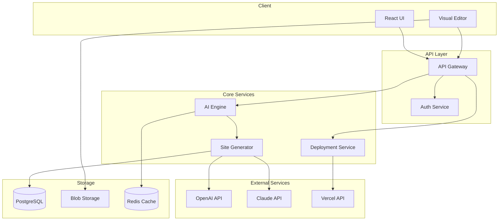

# Aether Technical Specification Document

## 1. Executive Summary

Aether는 AI 기반 웹사이트 빌더로, GPT-4와 Next.js 14를 활용하여 30초 내에 전문 웹사이트를 생성합니다. React 컴포넌트 기반 아키텍처와 Vercel Edge Runtime을 통해 즉시 배포 가능한 사이트를 제공하며, 드래그앤드롭 비주얼 에디터로 실시간 편집이 가능합니다.

**핵심 기술 결정:**
- **Monorepo**: Turborepo로 패키지 관리 최적화
- **Runtime**: Vercel Edge Runtime으로 콜드 스타트 제거
- **AI Strategy**: LiteLLM 통합 게이트웨이로 모든 AI 모델 관리 (GPT-4, Claude, DALL-E)
- **State Management**: Zustand + Immer로 불변성 관리
- **Deployment**: Vercel API 직접 통합으로 30초 내 배포

## 2. Project Structure

```
aether/
├── apps/
│   ├── web/                      # 메인 Next.js 애플리케이션
│   │   ├── app/                  # App Router
│   │   │   ├── (auth)/          # 인증 관련 라우트
│   │   │   ├── (dashboard)/     # 대시보드 라우트
│   │   │   ├── api/             # API 라우트
│   │   │   │   ├── ai/          # AI 엔드포인트
│   │   │   │   ├── sites/       # 사이트 관리
│   │   │   │   └── deploy/      # 배포 API
│   │   │   ├── editor/          # 비주얼 에디터
│   │   │   └── preview/         # 프리뷰 라우트
│   │   ├── components/          # 앱 컴포넌트
│   │   │   ├── editor/          # 에디터 컴포넌트
│   │   │   ├── canvas/          # 캔버스 컴포넌트
│   │   │   └── ui/              # UI 컴포넌트
│   │   ├── lib/                 # 유틸리티
│   │   │   ├── ai/              # AI 관련 로직
│   │   │   ├── db/              # DB 클라이언트
│   │   │   └── utils/           # 헬퍼 함수
│   │   └── hooks/               # 커스텀 훅
│   │
│   └── preview/                  # 프리뷰 서버
│       └── app/                  # 동적 사이트 렌더링
│
├── packages/
│   ├── ui/                      # 공유 UI 컴포넌트
│   │   ├── primitives/          # 기본 컴포넌트
│   │   ├── components/          # 복합 컴포넌트
│   │   └── icons/               # 아이콘
│   │
│   ├── ai-engine/               # AI 엔진
│   │   ├── prompts/             # 프롬프트 템플릿
│   │   ├── generators/          # 생성기
│   │   │   ├── structure.ts     # 구조 생성
│   │   │   ├── content.ts       # 콘텐츠 생성
│   │   │   └── design.ts        # 디자인 생성
│   │   ├── parsers/             # 응답 파서
│   │   └── validators/          # 검증기
│   │
│   ├── editor-core/             # 에디터 코어
│   │   ├── canvas/              # 캔버스 로직
│   │   ├── tools/               # 편집 도구
│   │   ├── history/             # 실행 취소/재실행
│   │   └── export/              # 내보내기
│   │
│   ├── templates/               # 템플릿 시스템
│   │   ├── base/                # 기본 템플릿
│   │   ├── saas/                # SaaS 템플릿
│   │   ├── portfolio/           # 포트폴리오
│   │   ├── ecommerce/           # 이커머스
│   │   └── blog/                # 블로그
│   │
│   ├── database/                # DB 스키마 & 타입
│   │   ├── schema/              # Prisma 스키마
│   │   ├── types/               # TypeScript 타입
│   │   └── migrations/          # 마이그레이션
│   │
│   └── config/                  # 공유 설정
│       ├── eslint/              # ESLint 설정
│       ├── typescript/          # TS 설정
│       └── tailwind/            # Tailwind 설정
│
├── scripts/                      # 빌드 & 배포 스크립트
│   ├── setup.sh                 # 초기 설정
│   ├── dev.sh                   # 개발 서버
│   └── deploy.sh                # 배포 스크립트
│
└── docs/                        # 문서
    ├── api/                     # API 문서
    ├── architecture/            # 아키텍처 문서
    └── deployment/              # 배포 가이드
```

## 3. Technology Stack

### Frontend

**Framework: Next.js 14 (App Router)**
- 이유: Server Components로 초기 로딩 최적화, Edge Runtime 지원, Vercel과 완벽한 통합
- 버전: `14.2.x` (안정성 확보)

**UI Library: React 18**
- 이유: Concurrent Rendering으로 대규모 DOM 업데이트 최적화, Suspense로 점진적 렌더링
- 버전: `18.3.x`

**State Management: Zustand + Immer**
- 이유: Redux 대비 90% 보일러플레이트 감소, TypeScript 완벽 지원, 4KB 번들 크기
- 버전: `zustand@4.5.x`, `immer@10.1.x`

**Styling: Tailwind CSS + Framer Motion**
- 이유: Utility-first로 빠른 프로토타이핑, 애니메이션으로 프리미엄 UX
- 버전: `tailwindcss@3.4.x`, `framer-motion@11.x`

**Editor: Custom React Canvas**
- 이유: 완전한 제어권, 웹 표준 기반, 경량화 (외부 라이브러리 대비 50% 크기)

### Backend

**Runtime: Vercel Edge Runtime**
- 이유: 콜드 스타트 0ms, 글로벌 엣지 배포, 자동 스케일링
- 제약: 50MB 함수 크기, 25초 타임아웃

**Database: Supabase (PostgreSQL) + Prisma ORM**
- 이유: Realtime 지원, 내장 인증, Row Level Security, 무료 티어 충분
- ORM: Prisma for type-safe database access
- 버전: PostgreSQL 15, Prisma 5.x

**File Storage: Vercel Blob**
- 이유: Edge Runtime 최적화, CDN 자동 적용, URL 서명으로 보안
- 용량: 무료 1GB

**Caching: Upstash Redis**
- 이유: Serverless Redis, Edge 호환, 자동 스케일링
- 용도: AI 응답 캐싱, Rate limiting, 세션 관리
- 무료 티어: 10,000 commands/day

**Authentication: Supabase Auth**
- 이유: OAuth 프로바이더 내장, JWT 토큰 관리, RLS 연동
- 제공자: Google, GitHub, Email

### AI/ML

**AI Gateway: LiteLLM**
- 이유: 통합 AI 게이트웨이로 모든 모델을 단일 인터페이스로 관리
- 장점: 자동 폴백, 비용 추적, 로드 밸런싱, 통합 모니터링
- 지원 모델: 100+ AI 모델 (OpenAI, Anthropic, Google, Meta 등)

**Primary Model: GPT-4-turbo (via LiteLLM)**
- 용도: 사이트 구조 생성, 복잡한 로직
- 특징: 128K 컨텍스트, JSON 모드 지원
- 비용: LiteLLM이 자동 계산

**Fallback Model: Claude-3-haiku (via LiteLLM)**
- 용도: 콘텐츠 생성, 빠른 응답이 필요한 작업
- 특징: GPT-4 대비 10배 빠른 속도
- 자동 폴백: LiteLLM이 GPT-4 실패 시 자동 전환

**Image Generation: DALL-E 3 (via LiteLLM)**
- 용도: 히어로 이미지, 아이콘 생성
- 특징: 프롬프트 준수율 최고
- 통합: LiteLLM 단일 엔드포인트로 관리

**Model Router Configuration**
- 구조 생성 → GPT-4-turbo
- 콘텐츠 작성 → Claude-3-opus
- 빠른 응답 → Claude-3-haiku
- 이미지 생성 → DALL-E 3

### Infrastructure

**Hosting: Vercel**
- 이유: Next.js 네이티브 지원, 자동 최적화, 프리뷰 배포
- 플랜: Pro ($20/월)

**CDN: Vercel Edge Network**
- 이유: 전 세계 80+ PoP, 자동 이미지 최적화, Brotli 압축
- 성능: P95 < 50ms

**Monitoring: Vercel Analytics**
- 이유: Real User Monitoring, Web Vitals 자동 추적, 무료 10K 페이지뷰
- 메트릭: LCP, FID, CLS, TTFB

**Error Tracking: Sentry**
- 이유: Source map 지원, 성능 프로파일링, 사용자 세션 재생
- 플랜: Developer (무료 5K 에러/월)

## 4. Development Conventions

### 코딩 스타일

```typescript
/**
 * 컴포넌트 작성 규칙
 * - Arrow function with FC type
 * - Props interface 명시적 정의
 * - JSDoc 주석으로 용도 설명
 */

import { FC, memo } from 'react';

interface IButtonProps {
  variant: 'primary' | 'secondary';
  size?: 'sm' | 'md' | 'lg';
  onClick?: () => void;
  children: React.ReactNode;
}

/**
 * 재사용 가능한 버튼 컴포넌트
 * @example
 * <Button variant="primary" size="lg">Click me</Button>
 */
export const Button: FC<IButtonProps> = memo(({ 
  variant, 
  size = 'md', 
  onClick, 
  children 
}) => {
  return (
    <button
      className={cn(
        'rounded-lg font-medium transition-colors',
        variants[variant],
        sizes[size]
      )}
      onClick={onClick}
    >
      {children}
    </button>
  );
});

Button.displayName = 'Button';
```

### 네이밍 컨벤션

- **파일명**: `kebab-case.ts` (예: `site-generator.ts`)
- **컴포넌트**: `PascalCase` (예: `VisualEditor`)
- **함수**: `camelCase` (예: `generateSiteStructure`)
- **상수**: `UPPER_SNAKE_CASE` (예: `MAX_GENERATION_TIME`)
- **타입/인터페이스**: `IPascalCase` 또는 `TPascalCase` (예: `ISiteConfig`, `TDeployStatus`)
- **환경변수**: `NEXT_PUBLIC_` 프리픽스 (클라이언트), 일반 (서버)

### Git 컨벤션

**브랜치 전략**
```bash
main          # 프로덕션
├── develop   # 개발 통합
├── feature/* # 기능 개발
├── fix/*     # 버그 수정
└── refactor/* # 리팩토링
```

**커밋 메시지**
```bash
feat: AI 사이트 생성 엔진 구현
fix: 에디터 드래그 버그 수정
refactor: 상태 관리 최적화
docs: API 문서 업데이트
test: 생성기 유닛 테스트 추가
chore: 의존성 업데이트
```

**PR 템플릿**
```markdown
## 변경 사항
- [ ] 구현 내용 설명

## 테스트
- [ ] 로컬 테스트 완료
- [ ] 타입 체크 통과
- [ ] Lint 통과

## 스크린샷
[필요시 첨부]
```

## 5. Core Module Architecture

### AI Engine Module

```typescript
// packages/ai-engine/types.ts
export interface IAIEngine {
  /**
   * 프롬프트로부터 전체 사이트 생성
   * @param prompt 사용자 입력
   * @returns 생성된 사이트 구조
   */
  generateSite(prompt: string): Promise<TSiteStructure>;
  
  /**
   * 개별 컴포넌트 생성
   * @param description 컴포넌트 설명
   * @returns React 컴포넌트 코드
   */
  generateComponent(description: string): Promise<TComponent>;
  
  /**
   * 콘텐츠 최적화
   * @param content 원본 콘텐츠
   * @param context 비즈니스 컨텍스트
   * @returns 최적화된 콘텐츠
   */
  optimizeContent(content: string, context: TBusinessContext): Promise<string>;
  
  /**
   * 이미지 생성
   * @param prompt 이미지 설명
   * @returns 생성된 이미지 URL
   */
  generateImage(prompt: string): Promise<string>;
}

// packages/ai-engine/generators/structure.ts
import { LiteLLMClient } from '../lib/litellm-client';

export class StructureGenerator {
  private readonly litellm: LiteLLMClient;
  private readonly cache: Map<string, TSiteStructure>;
  
  constructor() {
    this.litellm = new LiteLLMClient({
      apiBase: process.env.LITELLM_API_BASE,
      apiKey: process.env.LITELLM_API_KEY,
    });
  }
  
  async generate(prompt: string): Promise<TSiteStructure> {
    // 캐시 확인
    const cached = this.cache.get(this.hashPrompt(prompt));
    if (cached && !this.isExpired(cached)) return cached;
    
    // 프롬프트 강화
    const enhanced = await this.enhancePrompt(prompt);
    
    // LiteLLM으로 GPT-4 호출 (자동 폴백 포함)
    const completion = await this.litellm.chat.completions.create({
      model: process.env.AI_PRIMARY_MODEL || 'gpt-4-turbo-preview',
      messages: [
        { role: 'system', content: STRUCTURE_SYSTEM_PROMPT },
        { role: 'user', content: enhanced }
      ],
      response_format: { type: 'json_object' },
      temperature: 0.7,
      max_tokens: 4000,
      // LiteLLM이 자동으로 폴백 및 비용 추적
      metadata: {
        task: 'structure_generation',
        user_id: this.userId
      }
    });
    
    // 파싱 및 검증
    const structure = this.parseResponse(completion.choices[0].message.content);
    await this.validateStructure(structure);
    
    // 비용 정보 추출 (LiteLLM 제공)
    const cost = completion._hidden_params?.response_cost;
    await this.trackUsage(cost);
    
    // 캐싱
    this.cache.set(this.hashPrompt(prompt), structure);
    
    return structure;
  }
}
```

### Visual Editor Module

```typescript
// packages/editor-core/types.ts
export interface IVisualEditor {
  canvas: ICanvasAPI;
  tools: IToolsAPI;
  history: IHistoryAPI;
  export: IExportAPI;
  realtime: IRealtimeAPI;
}

// packages/editor-core/canvas/canvas.ts
export class CanvasAPI {
  private renderer: CanvasRenderer;
  private selection: SelectionManager;
  private viewport: ViewportManager;
  
  /**
   * 캔버스 초기화
   */
  initialize(container: HTMLElement): void {
    this.renderer = new CanvasRenderer(container);
    this.selection = new SelectionManager(this.renderer);
    this.viewport = new ViewportManager(this.renderer);
    
    this.setupEventListeners();
    this.setupDragAndDrop();
    this.setupKeyboardShortcuts();
  }
  
  /**
   * 컴포넌트 추가
   */
  addComponent(component: TComponent, position: TPosition): string {
    const id = generateId();
    const element = this.renderer.createElement(component, position);
    
    this.renderer.render(element);
    this.history.push({
      type: 'ADD',
      elementId: id,
      data: component
    });
    
    return id;
  }
  
  /**
   * 드래그 앤 드롭 설정
   */
  private setupDragAndDrop(): void {
    interact('.draggable').draggable({
      inertia: true,
      modifiers: [
        interact.modifiers.restrictRect({
          restriction: 'parent',
          endOnly: true
        })
      ],
      autoScroll: true,
      onmove: this.handleDragMove.bind(this),
      onend: this.handleDragEnd.bind(this)
    });
  }
}
```

### Deployment Module

```typescript
// packages/deployment/types.ts
export interface IDeploymentService {
  /**
   * 사이트 빌드
   */
  build(siteId: string): Promise<TBuildResult>;
  
  /**
   * Vercel 배포
   */
  deploy(buildId: string, config: TDeployConfig): Promise<TDeploymentResult>;
  
  /**
   * 롤백
   */
  rollback(deploymentId: string): Promise<void>;
  
  /**
   * 도메인 연결
   */
  connectDomain(deploymentId: string, domain: string): Promise<void>;
}

// packages/deployment/vercel.ts
export class VercelDeploymentService implements IDeploymentService {
  private readonly vercel: VercelClient;
  
  async deploy(buildId: string, config: TDeployConfig): Promise<TDeploymentResult> {
    // 프로젝트 생성 또는 업데이트
    const project = await this.vercel.projects.ensure({
      name: config.projectName,
      framework: 'nextjs',
      buildCommand: 'npm run build',
      outputDirectory: '.next'
    });
    
    // 소스 업로드
    const files = await this.prepareFiles(buildId);
    const deployment = await this.vercel.deployments.create({
      projectId: project.id,
      files,
      target: config.environment || 'production',
      regions: ['iad1'], // US East
      functions: {
        'api/**': {
          runtime: 'edge'
        }
      }
    });
    
    // 배포 상태 확인
    await this.waitForDeployment(deployment.id);
    
    return {
      id: deployment.id,
      url: deployment.url,
      status: 'ready',
      createdAt: new Date()
    };
  }
}
```

## 6. Security & Performance

### 보안 요구사항

**Rate Limiting**
```typescript
// middleware.ts
import { Ratelimit } from '@upstash/ratelimit';
import { Redis } from '@upstash/redis';

const ratelimit = new Ratelimit({
  redis: Redis.fromEnv(),
  limiter: Ratelimit.slidingWindow(10, '1 h'), // 시간당 10회
  analytics: true
});

export async function middleware(request: NextRequest) {
  const ip = request.ip ?? '127.0.0.1';
  const { success } = await ratelimit.limit(ip);
  
  if (!success) {
    return NextResponse.json(
      { error: 'Too many requests' },
      { status: 429 }
    );
  }
}
```

**API Key 관리**
```typescript
// lib/env.ts
import { z } from 'zod';

const envSchema = z.object({
  // LiteLLM Configuration (통합 AI 게이트웨이)
  LITELLM_API_BASE: z.string().url(),
  LITELLM_API_KEY: z.string().min(1),
  AI_PRIMARY_MODEL: z.string().default('gpt-4-turbo-preview'),
  AI_FALLBACK_MODEL: z.string().default('claude-3-haiku'),
  AI_IMAGE_MODEL: z.string().default('dall-e-3'),
  
  // Optional: Direct API keys for fallback
  OPENAI_API_KEY: z.string().min(1).optional(),
  ANTHROPIC_API_KEY: z.string().min(1).optional(),
  
  // Other services
  SUPABASE_URL: z.string().url(),
  SUPABASE_ANON_KEY: z.string().min(1),
  VERCEL_TOKEN: z.string().min(1)
});

export const env = envSchema.parse(process.env);
```

**CORS 설정**
```typescript
// next.config.js
const securityHeaders = [
  {
    key: 'X-DNS-Prefetch-Control',
    value: 'on'
  },
  {
    key: 'X-XSS-Protection',
    value: '1; mode=block'
  },
  {
    key: 'X-Frame-Options',
    value: 'SAMEORIGIN'
  },
  {
    key: 'X-Content-Type-Options',
    value: 'nosniff'
  },
  {
    key: 'Referrer-Policy',
    value: 'origin-when-cross-origin'
  }
];
```

**Input Validation**
```typescript
// lib/validation.ts
import { z } from 'zod';

export const siteGenerationSchema = z.object({
  prompt: z.string().min(10).max(500),
  template: z.enum(['saas', 'portfolio', 'ecommerce', 'blog', 'restaurant']).optional(),
  style: z.object({
    colorScheme: z.enum(['light', 'dark', 'auto']).optional(),
    font: z.enum(['modern', 'classic', 'playful']).optional()
  }).optional()
});

export function validateInput<T>(schema: z.ZodSchema<T>, data: unknown): T {
  return schema.parse(data);
}
```

### 캐싱 전략

```typescript
// lib/cache.ts
import { Redis } from '@upstash/redis';
import { createHash } from 'crypto';

interface CacheStrategy {
  aiGeneration: {
    keyPattern: `ai:gen:${string}`,
    ttl: 3600, // 1시간
    maxSize: 1000
  },
  sitePreview: {
    keyPattern: `preview:${string}`,
    ttl: 300, // 5분
    maxSize: 500
  },
  userQuota: {
    keyPattern: `quota:${string}`,
    ttl: 86400, // 24시간
    maxSize: 10000
  },
  templates: {
    keyPattern: `template:${string}`,
    ttl: 604800, // 7일
    maxSize: 100
  }
}

export class CacheManager {
  private redis: Redis;
  
  async getOrSet<T>(
    key: string,
    factory: () => Promise<T>,
    ttl: number
  ): Promise<T> {
    const cached = await this.redis.get(key);
    if (cached) return cached as T;
    
    const value = await factory();
    await this.redis.set(key, value, { ex: ttl });
    return value;
  }
  
  generateKey(prefix: string, data: any): string {
    const hash = createHash('sha256')
      .update(JSON.stringify(data))
      .digest('hex')
      .substring(0, 16);
    return `${prefix}:${hash}`;
  }
}
```

### Prisma 스키마

```prisma
// packages/database/prisma/schema.prisma
generator client {
  provider = "prisma-client-js"
  previewFeatures = ["jsonProtocol"]
}

datasource db {
  provider = "postgresql"
  url      = env("DATABASE_URL")
  directUrl = env("DIRECT_URL")
}

model User {
  id                String   @id @default(uuid())
  email             String   @unique
  username          String?  @unique
  fullName          String?  @map("full_name")
  avatarUrl         String?  @map("avatar_url")
  subscriptionTier  String   @default("free") @map("subscription_tier")
  aiCreditsUsed     Int      @default(0) @map("ai_credits_used")
  monthlyAiCredits  Int      @default(10) @map("monthly_ai_credits")
  sites             Site[]
  createdAt         DateTime @default(now()) @map("created_at")
  updatedAt         DateTime @updatedAt @map("updated_at")
  
  @@map("users")
}

model Site {
  id             String       @id @default(uuid())
  userId         String       @map("user_id")
  name           String
  slug           String       @unique
  components     Json         // JSONB in PostgreSQL
  theme          Json?
  status         String       @default("draft")
  deploymentUrl  String?      @map("deployment_url")
  user           User         @relation(fields: [userId], references: [id], onDelete: Cascade)
  deployments    Deployment[]
  backups        SiteBackup[]
  createdAt      DateTime     @default(now()) @map("created_at")
  updatedAt      DateTime     @updatedAt @map("updated_at")
  
  @@index([userId])
  @@index([slug])
  @@map("sites")
}

model SiteBackup {
  id         String   @id @default(uuid())
  siteId     String   @map("site_id")
  backupData Json     @map("backup_data")
  site       Site     @relation(fields: [siteId], references: [id], onDelete: Cascade)
  createdAt  DateTime @default(now()) @map("created_at")
  expiresAt  DateTime @map("expires_at")
  
  @@index([siteId])
  @@map("site_backups")
}

model Deployment {
  id            String   @id @default(uuid())
  siteId        String   @map("site_id")
  deploymentId  String   @unique @map("deployment_id")
  status        String   @default("pending")
  site          Site     @relation(fields: [siteId], references: [id], onDelete: Cascade)
  createdAt     DateTime @default(now()) @map("created_at")
  completedAt   DateTime? @map("completed_at")
  
  @@index([siteId])
  @@map("deployments")
}

model AuditLog {
  id           String   @id @default(uuid())
  userId       String?  @map("user_id")
  action       String
  resourceType String?  @map("resource_type")
  resourceId   String?  @map("resource_id")
  ipAddress    String?  @map("ip_address")
  userAgent    String?  @map("user_agent")
  metadata     Json?
  createdAt    DateTime @default(now()) @map("created_at")
  
  @@index([userId])
  @@index([resourceType, resourceId])
  @@map("audit_logs")
}
```

### 성능 목표

**Core Web Vitals**
- **LCP (Largest Contentful Paint)**: < 1.5s
  - Image optimization with next/image
  - Font preloading
  - Critical CSS inlining
  
- **FID (First Input Delay)**: < 100ms
  - Code splitting per route
  - Lazy loading components
  - Web Workers for heavy computation
  
- **CLS (Cumulative Layout Shift)**: < 0.1
  - Explicit dimensions for images
  - Font fallback optimization
  - Skeleton loaders

**AI Generation Performance**
```typescript
// AI 생성 최적화
const GENERATION_OPTIMIZATIONS = {
  parallel: true, // 병렬 처리
  streaming: true, // 스트리밍 응답
  caching: true, // Redis 캐싱
  timeout: 25000, // 25초 타임아웃
  retries: 2, // 재시도 횟수
  
  targets: {
    total: 30000, // 30초
    structure: 5000, // 5초
    content: 10000, // 10초
    design: 5000, // 5초
    assembly: 10000 // 10초
  }
};
```

## 7. Error Handling & Logging

### 에러 처리 전략

```typescript
// lib/errors.ts
export class AppError extends Error {
  constructor(
    public code: string,
    message: string,
    public statusCode: number = 500,
    public isOperational: boolean = true
  ) {
    super(message);
    Object.setPrototypeOf(this, AppError.prototype);
  }
}

export const ErrorCodes = {
  // AI 관련
  AI_GENERATION_FAILED: 'AI_001',
  AI_QUOTA_EXCEEDED: 'AI_002',
  AI_TIMEOUT: 'AI_003',
  
  // 배포 관련
  DEPLOY_FAILED: 'DEPLOY_001',
  DEPLOY_TIMEOUT: 'DEPLOY_002',
  
  // 인증 관련
  UNAUTHORIZED: 'AUTH_001',
  TOKEN_EXPIRED: 'AUTH_002'
} as const;

// Global error handler
export function errorHandler(error: Error, req: Request, res: Response) {
  if (error instanceof AppError) {
    return res.status(error.statusCode).json({
      error: {
        code: error.code,
        message: error.message
      }
    });
  }
  
  // Sentry로 전송
  Sentry.captureException(error);
  
  return res.status(500).json({
    error: {
      code: 'INTERNAL_ERROR',
      message: 'An unexpected error occurred'
    }
  });
}
```

### 로깅 전략

```typescript
// lib/logger.ts
import pino from 'pino';

const logger = pino({
  level: process.env.NODE_ENV === 'production' ? 'info' : 'debug',
  transport: {
    target: 'pino-pretty',
    options: {
      colorize: true
    }
  }
});

// 구조화된 로깅
export const log = {
  info: (message: string, data?: any) => logger.info(data, message),
  error: (message: string, error?: any) => logger.error(error, message),
  debug: (message: string, data?: any) => logger.debug(data, message),
  
  // AI 생성 로깅
  aiGeneration: (siteId: string, duration: number, success: boolean) => {
    logger.info({
      event: 'ai_generation',
      siteId,
      duration,
      success
    });
  },
  
  // 배포 로깅
  deployment: (siteId: string, deploymentId: string, status: string) => {
    logger.info({
      event: 'deployment',
      siteId,
      deploymentId,
      status
    });
  }
};
```

## 8. Testing Strategy

### 테스트 레벨

**Unit Tests (Vitest)**
```typescript
// __tests__/ai-engine.test.ts
import { describe, it, expect, vi } from 'vitest';
import { StructureGenerator } from '@/ai-engine/generators/structure';

describe('StructureGenerator', () => {
  it('should generate valid site structure', async () => {
    const generator = new StructureGenerator();
    const result = await generator.generate('SaaS landing page for AI tool');
    
    expect(result).toMatchObject({
      pages: expect.arrayContaining([
        expect.objectContaining({
          path: '/',
          components: expect.any(Array)
        })
      ])
    });
  });
  
  it('should cache repeated prompts', async () => {
    const generator = new StructureGenerator();
    const spy = vi.spyOn(generator, 'callOpenAI');
    
    await generator.generate('test prompt');
    await generator.generate('test prompt');
    
    expect(spy).toHaveBeenCalledTimes(1);
  });
});
```

**Integration Tests (Playwright)**
```typescript
// e2e/site-generation.spec.ts
import { test, expect } from '@playwright/test';

test('complete site generation flow', async ({ page }) => {
  await page.goto('/');
  
  // 프롬프트 입력
  await page.fill('[data-testid="prompt-input"]', 'Create a portfolio site');
  await page.click('[data-testid="generate-button"]');
  
  // 생성 진행 확인
  await expect(page.locator('[data-testid="progress-bar"]')).toBeVisible();
  
  // 30초 내 완료 확인
  await expect(page.locator('[data-testid="preview-frame"]')).toBeVisible({
    timeout: 30000
  });
  
  // 배포 버튼 확인
  await expect(page.locator('[data-testid="deploy-button"]')).toBeEnabled();
});
```

### 테스트 커버리지 목표
- **Core logic**: 80% (AI 엔진, 에디터 코어)
- **API endpoints**: 90% (모든 엔드포인트)
- **UI components**: 60% (주요 컴포넌트)
- **Integration**: 70% (E2E 시나리오)

## 9. Development Environment

### 필수 도구
```bash
# 시스템 요구사항
Node.js 20.x LTS
pnpm 8.x
Git 2.x

# VS Code 확장
- ESLint
- Prettier
- Tailwind CSS IntelliSense
- Prisma
- Thunder Client (API 테스트)
```

### 환경 변수
```env
# .env.local
NODE_ENV=development

# LiteLLM Configuration (Unified AI Gateway)
LITELLM_API_BASE=http://localhost:4000  # or https://your-litellm-proxy.com
LITELLM_API_KEY=your_litellm_key
AI_PRIMARY_MODEL=gpt-4-turbo-preview
AI_FALLBACK_MODEL=claude-3-haiku
AI_IMAGE_MODEL=dall-e-3

# Optional: Direct API Keys (for LiteLLM proxy or fallback)
OPENAI_API_KEY=sk-...  # Used by LiteLLM proxy
ANTHROPIC_API_KEY=sk-ant-...  # Used by LiteLLM proxy

# Supabase
NEXT_PUBLIC_SUPABASE_URL=https://xxx.supabase.co
NEXT_PUBLIC_SUPABASE_ANON_KEY=eyJ...
SUPABASE_SERVICE_KEY=eyJ...

# Vercel
VERCEL_TOKEN=xxx
VERCEL_TEAM_ID=team_xxx

# Redis (for caching)
REDIS_URL=redis://xxx

# Blob Storage
BLOB_READ_WRITE_TOKEN=vercel_blob_xxx

# Monitoring
NEXT_PUBLIC_SENTRY_DSN=https://xxx@sentry.io/xxx
NEXT_PUBLIC_MIXPANEL_TOKEN=xxx

# Feature Flags
NEXT_PUBLIC_ENABLE_AI_CACHE=true
NEXT_PUBLIC_ENABLE_STREAMING=true
```

### 개발 스크립트
```json
{
  "scripts": {
    "dev": "turbo dev",
    "build": "turbo build",
    "test": "turbo test",
    "test:e2e": "playwright test",
    "lint": "turbo lint",
    "type-check": "turbo type-check",
    "db:push": "prisma db push",
    "db:migrate": "prisma migrate dev",
    "db:studio": "prisma studio",
    "litellm:start": "litellm --config ./litellm-config.yaml",
    "litellm:test": "curl http://localhost:4000/health",
    "analyze": "ANALYZE=true pnpm build",
    "clean": "turbo clean && rm -rf node_modules"
  }
}
```

## 10. CI/CD Pipeline

### GitHub Actions Workflow

```yaml
# .github/workflows/ci.yml
name: CI

on:
  push:
    branches: [main, develop]
  pull_request:
    branches: [main]

jobs:
  lint:
    runs-on: ubuntu-latest
    steps:
      - uses: actions/checkout@v4
      - uses: pnpm/action-setup@v2
      - uses: actions/setup-node@v4
        with:
          node-version: 20
          cache: 'pnpm'
      - run: pnpm install
      - run: pnpm lint
      - run: pnpm type-check

  test:
    runs-on: ubuntu-latest
    steps:
      - uses: actions/checkout@v4
      - uses: pnpm/action-setup@v2
      - uses: actions/setup-node@v4
        with:
          node-version: 20
          cache: 'pnpm'
      - run: pnpm install
      - run: pnpm test
      - uses: codecov/codecov-action@v3

  e2e:
    runs-on: ubuntu-latest
    steps:
      - uses: actions/checkout@v4
      - uses: pnpm/action-setup@v2
      - uses: actions/setup-node@v4
        with:
          node-version: 20
          cache: 'pnpm'
      - run: pnpm install
      - run: pnpm playwright install
      - run: pnpm test:e2e

  deploy:
    needs: [lint, test]
    runs-on: ubuntu-latest
    if: github.ref == 'refs/heads/main'
    steps:
      - uses: actions/checkout@v4
      - uses: vercel/action@v24
        with:
          vercel-token: ${{ secrets.VERCEL_TOKEN }}
          vercel-org-id: ${{ secrets.VERCEL_ORG_ID }}
          vercel-project-id: ${{ secrets.VERCEL_PROJECT_ID }}
          vercel-args: '--prod'
```

### Vercel 배포 설정

```json
// vercel.json
{
  "framework": "nextjs",
  "buildCommand": "pnpm build",
  "devCommand": "pnpm dev",
  "installCommand": "pnpm install",
  "regions": ["iad1"],
  "functions": {
    "app/api/ai/generate/route.ts": {
      "maxDuration": 25
    },
    "app/api/deploy/route.ts": {
      "maxDuration": 30
    }
  },
  "crons": [
    {
      "path": "/api/cron/cleanup",
      "schedule": "0 2 * * *"
    }
  ]
}
```

## 11. Documentation Standards

### 코드 문서화

```typescript
/**
 * AI 사이트 생성 서비스
 * 
 * @description
 * 사용자 프롬프트를 받아 완전한 웹사이트 구조를 생성합니다.
 * GPT-4를 사용하여 구조를 생성하고, Claude-3로 콘텐츠를 최적화합니다.
 * 
 * @example
 * ```typescript
 * const generator = new SiteGenerator();
 * const site = await generator.generate({
 *   prompt: "SaaS landing page for AI tool",
 *   template: "saas",
 *   style: { colorScheme: "dark" }
 * });
 * ```
 * 
 * @see {@link https://docs.aether.io/api/generation}
 */
export class SiteGenerator {
  /**
   * 사이트 생성
   * 
   * @param config - 생성 설정
   * @returns 생성된 사이트 구조
   * @throws {AIGenerationError} AI 생성 실패 시
   * @throws {ValidationError} 입력 검증 실패 시
   */
  async generate(config: ISiteGenerationConfig): Promise<TSiteStructure> {
    // Implementation
  }
}
```

### API 문서 (OpenAPI)

```yaml
# docs/api/openapi.yml
openapi: 3.0.0
info:
  title: Aether API
  version: 1.0.0
  description: AI-powered website builder API

paths:
  /api/ai/generate:
    post:
      summary: Generate website from prompt
      requestBody:
        required: true
        content:
          application/json:
            schema:
              type: object
              properties:
                prompt:
                  type: string
                  minLength: 10
                  maxLength: 500
                template:
                  type: string
                  enum: [saas, portfolio, ecommerce, blog, restaurant]
      responses:
        200:
          description: Site generated successfully
          content:
            application/json:
              schema:
                $ref: '#/components/schemas/Site'
```

### 아키텍처 문서



## Appendix

### A. 참고 자료
- [Next.js 14 Documentation](https://nextjs.org/docs)
- [Vercel Edge Runtime](https://vercel.com/docs/functions/edge-runtime)
- [OpenAI API Reference](https://platform.openai.com/docs)
- [Supabase Documentation](https://supabase.com/docs)
- [Tailwind CSS](https://tailwindcss.com/docs)

### B. 용어 정의
- **Edge Runtime**: Vercel의 경량 JavaScript 런타임
- **ISR**: Incremental Static Regeneration
- **RLS**: Row Level Security (Supabase)
- **LCP**: Largest Contentful Paint
- **FID**: First Input Delay
- **CLS**: Cumulative Layout Shift

### C. Week 1 체크리스트

**Day 1: 프로젝트 설정**
- [ ] Monorepo 구조 설정 (Turborepo)
- [ ] Next.js 14 앱 생성
- [ ] Supabase 프로젝트 설정
- [ ] 환경 변수 구성
- [ ] Git 저장소 초기화

**Day 2: AI 엔진**
- [ ] OpenAI SDK 통합
- [ ] 구조 생성기 구현
- [ ] 콘텐츠 생성기 구현
- [ ] 프롬프트 템플릿 작성
- [ ] 응답 파서 구현

**Day 3: 에디터 기초**
- [ ] Canvas 컴포넌트 구현
- [ ] 드래그앤드롭 구현
- [ ] 선택 도구 구현
- [ ] 속성 패널 구현
- [ ] 실시간 프리뷰

**Day 4: 템플릿**
- [ ] SaaS 템플릿
- [ ] Portfolio 템플릿
- [ ] E-commerce 템플릿
- [ ] Blog 템플릿
- [ ] Restaurant 템플릿

**Day 5: 배포**
- [ ] Vercel API 통합
- [ ] 빌드 프로세스 구현
- [ ] 배포 파이프라인
- [ ] 도메인 관리
- [ ] 상태 모니터링

**Day 6-7: 통합**
- [ ] E2E 플로우 테스트
- [ ] 성능 최적화
- [ ] 버그 수정
- [ ] 문서 작성
- [ ] 데모 준비

### D. 성능 최적화 체크리스트
- [ ] 이미지 최적화 (WebP, AVIF)
- [ ] 폰트 최적화 (subset, preload)
- [ ] 코드 스플리팅
- [ ] Tree shaking
- [ ] Lazy loading
- [ ] HTTP/2 Push
- [ ] Brotli 압축
- [ ] Edge caching
- [ ] Database indexing
- [ ] Redis caching